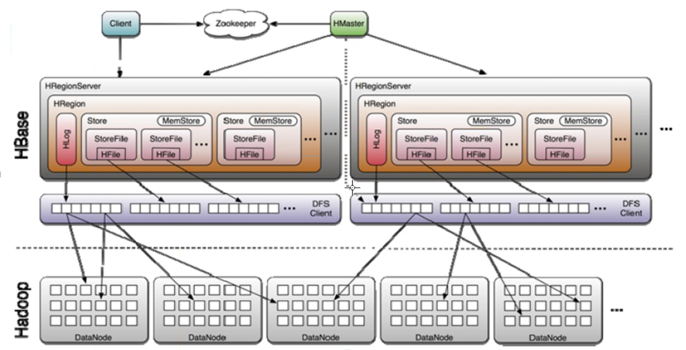

1. 安装

- 已安装 hadoop、zookeep

## 1.1 下载：
下载地址（个版本列表）：http://archive.apache.org/dist/hbase/
wget http://mirror.bit.edu.cn/apache/hbase/1.2.6/hbase-1.2.6-bin.tar.gz

## 1.3 修改配置
- hbase-env.sh
```
export JAVA_HOME=/zz/app/jdk
export HBASE_MANAGES_ZK=false
```

- hbase-site.xml
```
<configuration>
	<property>
		<name>hbase.master</name>
		<value>master:60000</value>
	</property>
	<!-- 主备间隔时间 -->
	<property>
		<name>hbase.master.maxclockskew</name> 
		<value>180000</value>
	</property>
	
	<property>
		<name>hbase.rootdir</name>
		<value>hdfs://master:9000/hbase</value>
	</property>
	<property>
		<name>hbase.cluster.distributed</name>
		<value>true</value>
	</property>

	<property>
		<name>hbase.zookeeper.quorum</name>
		<value>master,work1,work2</value>
	</property>
	<property>
		<name>hbase.zookeeper.property.dataDir</name>
		<value>/servers/hbase/zookeeper</value>
	</property>
</configuration>
```

- vim conf/regionservers
```
work1
work2
```

## 1.3 同步、修改权限
```
/zz/shell/scp.sh /etc/profile /etc/
/zz/shell/scp.sh hbase/conf/hbase-site.xml /zz/app/hbase/conf/
/zz/shell/scp.sh hbase/conf/hbase-env.sh /zz/app/hbase/conf/
/zz/shell/scp.sh hbase/conf/regionservers /zz/app/hbase/conf/			 

chown -R hadoop:hadoop /zz/app/hbase
chown -R hadoop:hadoop /zz/app/hbase-1.2.6
```
`source /etc/profile`

## 1.4 启动、停止
```
#启动全部进程
./bin/start-hbase.sh

#单独启动hmaster
bin/hbase-daemon.sh start master 

#停止
./bin/stop-hbase.sh
```
## 1.5 进程
- master节点
  HMaster
- work节点
  HRegionServer

## 1.6 web ui
- HMaster
  http://master:16010
- RegionServer
  http://master:16030

## 1.7 jdk、hadoop支持

### 1.7.1 jdk
This section lists required services and some required system configuration.

| HBase Version | JDK 7                                    | JDK 8                                    |
| ------------- | ---------------------------------------- | ---------------------------------------- |
| 2.0           | [Not Supported](http://search-hadoop.com/m/YGbbsPxZ723m3as) | yes                                      |
| 1.3           | yes                                      | yes                                      |
| 1.2           | yes                                      | yes                                      |
| 1.1           | yes                                      | Running with JDK 8 will work but is not well tested. |

HBase will neither build nor compile with Java 6.
You must set `JAVA_HOME` on each node of your cluster. *hbase-env.sh* provides a handy mechanism to do this.


### 1.7.2 hadoop
Hadoop version support matrix

- "S" = supported
- "X" = not supported
- "NT" = Not tested

|                    | HBase-1.1.x | HBase-1.2.x | HBase-1.3.x | HBase-2.0.x |
| ------------------ | ----------- | ----------- | ----------- | ----------- |
| Hadoop-2.0.x-alpha | X           | X           | X           | X           |
| Hadoop-2.1.0-beta  | X           | X           | X           | X           |
| Hadoop-2.2.0       | NT          | X           | X           | X           |
| Hadoop-2.3.x       | NT          | X           | X           | X           |
| Hadoop-2.4.x       | S           | S           | S           | X           |
| Hadoop-2.5.x       | S           | S           | S           | X           |
| Hadoop-2.6.0       | X           | X           | X           | X           |
| Hadoop-2.6.1+      | NT          | S           | S           | S           |
| Hadoop-2.7.0       | X           | X           | X           | X           |
| Hadoop-2.7.1+      | NT          | S           | S           | S           |
| Hadoop-2.8.0       | X           | X           | X           | X           |
| Hadoop-2.8.1       | X           | X           | X           | X           |
| Hadoop-3.0.0       | NT          | NT          | NT          | NT          |


# 2. hbase shell
## 2.1 基本语法

| 名称                       | 命令表达式                                                   |
| -------------------------- | ------------------------------------------------------------ |
| 创建表                     | create '表名', '列族名1','列族名2','列族名N'                 |
| 查看所有表                 | list                                                         |
| 描述表                     | describe  ‘表名’                                             |
| 判断表存在                 | exists  '表名'                                               |
| 判断是否禁用启用表         | is_enabled '表名'is_disabled ‘表名’                          |
| 添加记录                   | put  ‘表名’, ‘rowKey’, ‘列族 : 列‘  ,  '值'                  |
| 查看记录rowkey下的所有数据 | get  '表名' , 'rowKey'                                       |
| 查看表中的记录总数         | count  '表名'                                                |
| 获取某个列族               | get '表名','rowkey','列族'                                   |
| 获取某个列族的某个列       | get '表名','rowkey','列族：列’                               |
| 删除记录                   | delete  ‘表名’ ,‘行名’ , ‘列族：列'                          |
| 删除整行                   | deleteall '表名','rowkey'                                    |
| 删除一张表                 | 先要屏蔽该表，才能对该表进行删除第一步 disable ‘表名’ ，第二步  drop '表名' |
| 清空表                     | truncate '表名'                                              |
| 查看所有记录               | scan "表名"                                                  |
| 查看某个表某个列中所有数据 | scan "表名" , {COLUMNS=>'列族名:列名'}                       |
| 更新记录                   | 就是重写一遍，进行覆盖，hbase没有修改，都是追加              |

- 进入hbase shell：
`./bin/hbase shell`
- 创建表hbase_1102有两个列族CF1和CF2
`create 'person',  {NAME=>'cf1'}, {NAME=>'cf2'}`
- 向表中添加数据，在想HBase的表中添加数据的时候，只能一列一列的添加，不能同时添加多列。
```
hbase(main):042:0> put 'person', '001','cf1:name','Tom'
hbase(main):043:0> put 'person', '001','cf1:age','18'
hbase(main):044:0> put 'person', '001','cf1:sex','男'
hbase(main):045:0> put 'person', '001','cf1:birthday','2018/01/02 22:10:00'
```

# 3. 
主HMaster：不存任何信息，只管理HReginServer挂掉后数据迁移和表的信息，不管理数据信息；
集群运行起来，表创建完了，HMaster挂了照样跑

从HReginServer：缓存数据


- hbase是写快，读慢（慢是相对于写来说的）
- 写数据
  - 来了一条数据通过zookeeper定位写到哪台HReginServer上
  - 
- 读数据

# 4
- 一个列组对应一个MemStore 和 一个BockCache 、多个HFile；一个HFile只能对应一个列组
- 一列组的数据存放在多个HFile里，但一行中列组的数据物理存放在一起
- 主（master）分配Region给RegionServer，每个RegionServer一般托管多个Region
- Region大小控制参数：HBase.hregion.max.filesize

- 预装过滤器：
  - 行过滤器：RowFilter
  - 前缀过滤器：Prefixilter(基于行健前缀过滤)
  - 限定符（列）过滤器：QualifierFilter
  - 值过滤器：ValueFilter
  - 时间戳过滤器：TimestampFilter
  - 过滤器列表：FilterList


# 5. 过滤器

## 5.1 参考地址：
- hbase过滤器：
	https://www.cnblogs.com/similarface/p/5805973.html
	http://blog.chinaunix.net/uid-77311-id-4617954.html
	http://www.aboutyun.com/thread-8895-1-1.html
	https://blog.csdn.net/lr131425/article/details/72676254
- hbase shell 过滤器：
	https://www.cnblogs.com/mayidudu/p/6056772.html

## 5.2 hbase过滤器中的比较
- 比较符如下:

| Operator         | Description |
| ---------------- | ----------- |
| LESS             | 小于        |
| LESS_OR_EQUAL    | 小于等于    |
| EQUAL            | 等于        |
| NOT_EQUAL        | 不等于      |
| GREATER_OR_EQUAL | 大于等于    |
| GREATER          | 大于        |
| NO_OP            | 排除所有    |

- 比较器

| Comparator             | Description                                                  |
| ---------------------- | ------------------------------------------------------------ |
| BinaryComparator       | 使用Bytes.compareTo()比较                                    |
| BinaryPrefixComparator | 和BinaryComparator差不多，从前面开始比较                     |
| NullComparator         | Does not compare against an actual value but whether a given one is null, or not  null. |
| BitComparator          | Performs a bitwise comparison, providing a BitwiseOp class with OR, and XORoperators. |
| RegexStringComparator  | 正则表达式                                                   |
| SubstringComparator    | 把数据当成字符串，用contains()来判断                         |

- 在RowFilter中使用实例:
  - 提取rowkey值为 rowkeyvalue 的
    ```
    Filter filter1 = new RowFilter(CompareFilter.CompareOp.EQUAL, new BinaryComparator(Bytes.toBytes(rowkeyvalue)));
    ```
  - 提取rowkey以01结尾数据
    ```
    Filter filter = new RowFilter(CompareFilter.CompareOp.EQUAL,new RegexStringComparator(".*01$"));
    ```

  - 提取rowkey以包含201407的数据
    ```
      Filter filter = new RowFilter(CompareFilter.CompareOp.EQUAL,new SubstringComparator("201407"));
    ```
  
  - 提取rowkey以123开头的数据
    ```
    Filter filter = new RowFilter(CompareFilter.CompareOp.EQUAL,new BinaryPrefixComparator("123".getBytes()));
    ```

## 5.3 行健过滤器
### 5.3.1 RowFilter
  可以结合比较器使用，例如：
  ```
  //这儿是指找出行小于或者等于"510824118261011172"的所有行
  Filter filter1 = new RowFilter(CompareFilter.CompareOp.LESS_OR_EQUAL, new BinaryComparator(Bytes.toBytes("813782218261011172")));
  
  //添加过滤器到扫描器中
  scan.setFilter(filter1);
  
  //正则过滤器
  //过滤行键以2结束的
  Filter filter2 = new RowFilter(CompareFilter.CompareOp.EQUAL, new RegexStringComparator(".*2$"));
  
  //子串过滤器
  //过滤行键中包含了"61826"这个字符串
  Filter filter3=new RowFilter(CompareFilter.CompareOp.EQUAL, new SubstringComparator("61826"));
  ```
### 5.3.2 前缀进行过滤
- PrefixFilter:根据行键的前缀进行过滤
  ```
  Filter filter = new PrefixFilter(Bytes.toBytes("510824"));
  ```

### 5.3.3 分页过滤
- PageFilter: 根据行健分页过滤
  ```
  Filter filter = new PageFilter(3);
  ```
- 分页实例详解：
  https://blog.csdn.net/MrSaber/article/details/77018816

### 5.3.4 首次行键过滤器
- KeyOnlyFilter： 行键过滤器， 首次行键过滤器, rowkey相同的只会返回第一个rowkey的所在cell数据

### 5.3.5 随机行过滤器
- RandomRowFilter: 该构造参数0-1之间,如果为负数全部过滤,大于1全部通过 0.2f表的该行数据20%的概率通过
  ```
  Filter filter = new RandomRowFilter(0.2f);
  Scan scan = new Scan();
  scan.setFilter(filter);
  ResultScanner results = table.getScanner(scan);
  ```

### 5.3.6 匹配到就中断扫描
- WhileMatchFilter: 全匹配过滤器 [当匹配到就中断扫描]
  ```
  //  匹配 510824118261011172 的行马上中断本次扫描操作
  Filter filter2 = new WhileMatchFilter(filter1);
  ```


### 5.3.5 其它的一些过滤器
FirstKeyValueMatchingQualifiersFilter 

InclusiveStopFilter 包含结束的过滤器
FuzzyRowFilter 模糊行匹配过滤器


## 5.4 列族过滤器
### 5.4.1 FamilyFilter
```
//比较过滤器 现在表有2个列族 info  ship 当然实际有可能很多哦
//取info < "kiss" <ship < "wings"
Filter filter1 = new FamilyFilter(CompareFilter.CompareOp.GREATER, new BinaryComparator(Bytes.toBytes("kiss")));

//获取一行数据
Get get2 = new Get(Bytes.toBytes("673782618261019142"));
//添加列族过滤器 info
Filter filter2= new FamilyFilter(CompareFilter.CompareOp.EQUAL,new BinaryComparator(Bytes.toBytes("info")));
get2.addFamily(Bytes.toBytes("ship"));
get2.setFilter(filter2);
Result result2 =table.get(get2);
```


## 5.5 列限定符过滤器
### 5.5.1 参考列过滤器
- DependentColumnFilter： 参考列过滤器，根据列名进行筛选

```
public static void filter(boolean drop,CompareFilter.CompareOp oper,ByteArrayComparable comparable) throws IOException {
	Filter filter;
	if (comparable != null) {
		filter = new DependentColumnFilter(Bytes.toBytes("info"), Bytes.toBytes("phone"), drop, oper, comparable);
	} else {
		filter = new DependentColumnFilter(Bytes.toBytes("info"), Bytes.toBytes("phone"), drop);
	}
}
public static void main(String[] args) throws IOException {
    filter(true, CompareFilter.CompareOp.NO_OP, null);
    filter(false, CompareFilter.CompareOp.NO_OP, null);
    filter(true, CompareFilter.CompareOp.EQUAL, new BinaryPrefixComparator(Bytes.toBytes("17713921424")));
    filter(false, CompareFilter.CompareOp.EQUAL, new BinaryPrefixComparator(Bytes.toBytes("17713921424")));
    filter(true, CompareFilter.CompareOp.EQUAL, new RegexStringComparator(".*\\.5"));
    filter(false, CompareFilter.CompareOp.EQUAL, new RegexStringComparator(".*\\.5"));
}
```

### 5.5.2 列计数过滤器
- ColumnCountGetFilter：列计数过滤器，可以使用这个过滤器来限制每行最多取回多少列，当一行的列数到设定的最大值，这个过滤器会停止整个扫描操作。适合在get方法中使用


### 5.5.3 列分页过滤
- ColumnPaginationFilter：列分页过滤， HBase 的列可以很多，所以出现了列分页，该过滤器可以对一行的所有列进行分页
- 构造函数：
ColumnPaginationFilter(int limit, int offset)
ColumnPaginationFilter(int limit, byte[] columnOffset)
limit 限制取回来列数  offset 偏移位就是开始位置 byte[] 字符串/书签偏移从哪里开始分页。
  ```
  //限制返回的列数 从第4列开始取 取3列数据
  ColumnPaginationFilter columnPaginationFilter = new ColumnPaginationFilter(3,4);

  //限制返回的列数 从第name列开始取 取3列数据
  ColumnPaginationFilter columnPaginationFilter2 = new ColumnPaginationFilter(3,Bytes.toBytes("name"));
  ```

### 5.5.4 列前缀过虑器
- ColumnPrefixFilter：列前缀过虑器, 该过滤器通过对列名称进行前缀匹配过滤
  ```
  //取列名已ag开头的
  Filter columnPrefixFilter = new ColumnPrefixFilter(Bytes.toBytes("ag"));
  ```

### 5.5.5 多个列前缀过滤器
- MultipleColumnPrefixFilter：多个列前缀过滤器
  ```
  Filter filter = new MultipleColumnPrefixFilter(new byte[][] {Bytes.toBytes("a"),Bytes.toBytes("h")});
  ```

### 5.5.6 列范围过滤器
- ColumnRangeFilter
  ```
  //minColumn - minimum value for the column range. If if it's null, there is no lower bound.
  //minColumnInclusive - if true, include minColumn in the range. 如果是true 就要包含minColumn
  //maxColumn - maximum value for the column range. If it's null,
  //maxColumnInclusive - if true, include maxColumn in the range. there is no upper bound.
  //从email到phone范围内的所有列 第二个参数为true所以包含了email <br>　　    
  Filter filter = new ColumnRangeFilter(Bytes.toBytes("email"), true, Bytes.toBytes("phone"), false);
  Get get = new Get(Bytes.toBytes("224382618261914241"));
  get.setFilter(filter);
  Result result = table.get(get);
  ```

### 5.5.7 列限定符过滤器
- QualifierFilter：列名过滤器，结合比较器使用
```
//列名过滤器
Filter filter3=new QualifierFilter(CompareFilter.CompareOp.EQUAL,
        new RegexStringComparator("age"));
filters.add(filter3);
```

## 5.6 列值过滤器
### 5.6.1 ValueFilter
- 根据值进行筛选 可以联合RegexStringComparator 进行设计
  ```
  //值中包含了177的过滤器
  Filter filter = new ValueFilter(CompareFilter.CompareOp.EQUAL, new SubstringComparator("1771392142"));
  ```

### 5.6.2 单列值过滤器
- SingleColumnValueFilter: 用一列的值决定是否一行数据被过滤
- 如果setFilterIfMissing(true), 有匹配只会返回当前列所在的行数据，基于行的数据 country 也返回了，因为他么你的rowkey是相同的
- 如果setFilterIfMissing（false），有匹配的列的值相同会返回，没有此列的 name的也会返回，， 不匹配的name则不会返回
  ```
  //  510824118261011172 column=ship:email, timestamp=1472196213422, value=199@sina.com
  SingleColumnValueFilter singleColumnValueFilter = new SingleColumnValueFilter(Bytes.toBytes("ship"),Bytes.toBytes("email"), CompareFilter.CompareOp.EQUAL,new SubstringComparator("199@sina.com"));
  singleColumnValueFilter.setFilterIfMissing(true);
  ```

### 5.6.3 单列排除过滤器
- SingleColumnValueExcludeFilter: 单列排除过滤器继承自SingleColumnValueFilter，过滤的方式还是按照SingleColumnValueFilter去过滤，但是最后的结果集去除了作为过滤条件的列
  ```
  //  510824118261011172 column=ship:email, timestamp=1472196213422, value=199@sina.com
  SingleColumnValueExcludeFilter singleColumnValueExcludeFilter = new SingleColumnValueExcludeFilter(Bytes.toBytes("ship"),Bytes.toBytes("email"), CompareFilter.CompareOp.EQUAL,new SubstringComparator("199@sina.com"));
  singleColumnValueExcludeFilter.setFilterIfMissing(true);
  ```

### 5.6.4 装饰过滤器或附加过滤器
- 如果列值中含有188这个数值,那么这列将会跳过
  ```
  //510824118261011172                                     column=info:height, timestamp=1472196213056, value=188
  //673782618261019142                                     column=info:weight, timestamp=1472196211841, value=188
  //如果列值中含有188这个数值,那么这列将会跳过
  Filter filter = new ValueFilter(CompareFilter.CompareOp.NOT_EQUAL,new BinaryComparator(Bytes.toBytes("188")));
  ```

### 5.6.5 跳过过滤器
- SkipFilter 跳过过滤器 根据构造器中的过滤器为基准跳过行
  ```
  //skipfilter的构造参数时filter
  //  filter==>如果列值中含有188这个数值,那么这列将会跳过 filter2==>就是如果列值中含有188这个数值那么整个行都会被跳过 表示不会出现[510824118261011172,673782618261019142]
  Filter filter2 = new SkipFilter(filter);
  scan1.setFilter(filter2);
  ```


## 5.7 时间过滤器
### 5.7.1 时间戳的值来过滤
- TimestampsFilter
  ```
  List<Long> ts = new ArrayList<Long>();
  ts.add(new Long("1472196195270"));
  ts.add(new Long("1472196212480"));
  ts.add(new Long(15));
  Filter filter = new TimestampsFilter(ts);
  Scan scan1 = new Scan();
  scan1.setFilter(filter);
  scanner1.close();
  
  Scan scan2 = new Scan();
  scan2.setFilter(filter);
  //加了时间范围 故意多加了1s 1472196212480+1=1472196212481
  scan2.setTimeRange(1472196195271L, 1472196212481L);
  scanner2.close();
  ```

## 5.8 过滤列表
- FilterList 过滤列表［多个过滤器一起起作用］
  ```
  List<Filter> filters = new ArrayList<Filter>();
  Filter filter1=new RowFilter(CompareFilter.CompareOp.GREATER_OR_EQUAL,
          new BinaryComparator(Bytes.toBytes("524382618264914241")));
  filters.add(filter1);
  Filter filter2=new RowFilter(CompareFilter.CompareOp.LESS_OR_EQUAL,
          new BinaryComparator(Bytes.toBytes("813782218261011172")));
  filters.add(filter2);
  //列名过滤器
  Filter filter3=new QualifierFilter(CompareFilter.CompareOp.EQUAL,
          new RegexStringComparator("age"));
  filters.add(filter3);
  //行键 Between "524382618264914241" and "813782218261011172"  and column="age"
  FilterList filterList1 = new FilterList(filters);
  Scan scan = new Scan();
  scan.setFilter(filterList1);
  ResultScanner results = table.getScanner(scan);
  results.close();
  //行键 Between "524382618264914241" or "813782218261011172"  or column="age"
  FilterList filterList2 = new FilterList(FilterList.Operator.MUST_PASS_ONE,filters);
  scan.setFilter(filterList2);
  ```

## 5.9 HBase filter shell操作
- https://www.cnblogs.com/mayidudu/p/6056772.html
```
创建表
create 'test1', 'lf', 'sf'
lf: column family of LONG values (binary value)
-- sf: column family of STRING values
 
导入数据
put 'test1', 'user1|ts1', 'sf:c1', 'sku1'
put 'test1', 'user1|ts2', 'sf:c1', 'sku188'
put 'test1', 'user1|ts3', 'sf:s1', 'sku123'

put 'test1', 'user2|ts4', 'sf:c1', 'sku2'
put 'test1', 'user2|ts5', 'sf:c2', 'sku288'
put 'test1', 'user2|ts6', 'sf:s1', 'sku222'
一个用户（userX），在什么时间（tsX），作为rowkey
 
对什么产品（value：skuXXX），做了什么操作作为列名，比如，c1: click from homepage; c2: click from ad; s1: search from homepage; b1: buy
 
查询案例
 
谁的值=sku188
 
scan 'test1', FILTER=>"ValueFilter(=,'binary:sku188')"

ROW                          COLUMN+CELL                    
user1|ts2                   column=sf:c1, timestamp=1409122354918, value=sku188
 
谁的值包含88
 
scan 'test1', FILTER=>"ValueFilter(=,'substring:88')"

ROW                          COLUMN+CELL    
 user1|ts2                   column=sf:c1, timestamp=1409122354918, value=sku188
 user2|ts5                   column=sf:c2, timestamp=1409122355030, value=sku288
  
 
通过广告点击进来的(column为c2)值包含88的用户
 
scan 'test1', FILTER=>"ColumnPrefixFilter('c2') AND ValueFilter(=,'substring:88')"
 
ROW                          COLUMN+CELL
 user2|ts5                   column=sf:c2, timestamp=1409122355030, value=sku288
通过搜索进来的(column为s)值包含123或者222的用户
 
scan 'test1', FILTER=>"ColumnPrefixFilter('s') AND ( ValueFilter(=,'substring:123') OR ValueFilter(=,'substring:222') )"

ROW                          COLUMN+CELL
 user1|ts3                   column=sf:s1, timestamp=1409122354954, value=sku123
 user2|ts6                   column=sf:s1, timestamp=1409122355970, value=sku222
 
rowkey为user1开头的
 
scan 'test1', FILTER => "PrefixFilter ('user1')"

ROW                          COLUMN+CELL
 user1|ts1                   column=sf:c1, timestamp=1409122354868, value=sku1
 user1|ts2                   column=sf:c1, timestamp=1409122354918, value=sku188
 user1|ts3                   column=sf:s1, timestamp=1409122354954, value=sku123
 
FirstKeyOnlyFilter: 一个rowkey可以有多个version,同一个rowkey的同一个column也会有多个的值, 只拿出key中的第一个column的第一个version
KeyOnlyFilter: 只要key,不要value
scan 'test1', FILTER=>"FirstKeyOnlyFilter() AND ValueFilter(=,'binary:sku188') AND KeyOnlyFilter()"

ROW                          COLUMN+CELL
 user1|ts2                   column=sf:c1, timestamp=1409122354918, value=
 
从user1|ts2开始,找到所有的rowkey以user1开头的
 
scan 'test1', {STARTROW=>'user1|ts2', FILTER => "PrefixFilter ('user1')"}

ROW                          COLUMN+CELL
 user1|ts2                   column=sf:c1, timestamp=1409122354918, value=sku188
 user1|ts3                   column=sf:s1, timestamp=1409122354954, value=sku123 
 
从user1|ts2开始,找到所有的到rowkey以user2开头
 
scan 'test1', {STARTROW=>'user1|ts2', STOPROW=>'user2'}

ROW                          COLUMN+CELL
 user1|ts2                   column=sf:c1, timestamp=1409122354918, value=sku188
 user1|ts3                   column=sf:s1, timestamp=1409122354954, value=sku123
查询rowkey里面包含ts3的
import org.apache.hadoop.hbase.filter.CompareFilter
import org.apache.hadoop.hbase.filter.SubstringComparator
import org.apache.hadoop.hbase.filter.RowFilter
scan 'test1', {FILTER => RowFilter.new(CompareFilter::CompareOp.valueOf('EQUAL'), SubstringComparator.new('ts3'))}
ROW                          COLUMN+CELL
 user1|ts3                   column=sf:s1, timestamp=1409122354954, value=sku123 
查询rowkey里面包含ts的
import org.apache.hadoop.hbase.filter.CompareFilter
import org.apache.hadoop.hbase.filter.SubstringComparator
import org.apache.hadoop.hbase.filter.RowFilter
scan 'test1', {FILTER => RowFilter.new(CompareFilter::CompareOp.valueOf('EQUAL'), SubstringComparator.new('ts'))}
 
ROW                          COLUMN+CELL
 user1|ts1                   column=sf:c1, timestamp=1409122354868, value=sku1
 user1|ts2                   column=sf:c1, timestamp=1409122354918, value=sku188
 user1|ts3                   column=sf:s1, timestamp=1409122354954, value=sku123
 user2|ts4                   column=sf:c1, timestamp=1409122354998, value=sku2
 user2|ts5                   column=sf:c2, timestamp=1409122355030, value=sku288
 user2|ts6                   column=sf:s1, timestamp=1409122355970, value=sku222
 
加入一条测试数据
put 'test1', 'user2|err', 'sf:s1', 'sku999'
查询rowkey里面以user开头的，新加入的测试数据并不符合正则表达式的规则，故查询不出来
import org.apache.hadoop.hbase.filter.RegexStringComparator
import org.apache.hadoop.hbase.filter.CompareFilter
import org.apache.hadoop.hbase.filter.SubstringComparator
import org.apache.hadoop.hbase.filter.RowFilter
scan 'test1', {FILTER => RowFilter.new(CompareFilter::CompareOp.valueOf('EQUAL'),RegexStringComparator.new('^user\d+\|ts\d+$'))}

ROW                          COLUMN+CELL
 user1|ts1                   column=sf:c1, timestamp=1409122354868, value=sku1
 user1|ts2                   column=sf:c1, timestamp=1409122354918, value=sku188
 user1|ts3                   column=sf:s1, timestamp=1409122354954, value=sku123
 user2|ts4                   column=sf:c1, timestamp=1409122354998, value=sku2
 user2|ts5                   column=sf:c2, timestamp=1409122355030, value=sku288
 user2|ts6                   column=sf:s1, timestamp=1409122355970, value=sku222
加入测试数据
put 'test1', 'user1|ts9', 'sf:b1', 'sku1'
b1开头的列中并且值为sku1的
scan 'test1', FILTER=>"ColumnPrefixFilter('b1') AND ValueFilter(=,'binary:sku1')"
 
ROW                          COLUMN+CELL                                                                       
 user1|ts9                   column=sf:b1, timestamp=1409124908668, value=sku1
SingleColumnValueFilter的使用，b1开头的列中并且值为sku1的
import org.apache.hadoop.hbase.filter.CompareFilter
import org.apache.hadoop.hbase.filter.SingleColumnValueFilter
import org.apache.hadoop.hbase.filter.SubstringComparator
scan 'test1', {COLUMNS => 'sf:b1', FILTER => SingleColumnValueFilter.new(Bytes.toBytes('sf'), Bytes.toBytes('b1'), CompareFilter::CompareOp.valueOf('EQUAL'), Bytes.toBytes('sku1'))}
 
ROW                          COLUMN+CELL
 user1|ts9                   column=sf:b1, timestamp=1409124908668, value=sku1
hbase zkcli 的使用
hbase zkcli
ls /
[hbase, zookeeper]
 
[zk: hadoop000:2181(CONNECTED) 1] ls /hbase
[meta-region-server, backup-masters, table, draining, region-in-transition, running, table-lock, master, namespace, hbaseid, online-snapshot, replication, splitWAL, recovering-regions, rs]
 
[zk: hadoop000:2181(CONNECTED) 2] ls /hbase/table
[member, test1, hbase:meta, hbase:namespace]
 
[zk: hadoop000:2181(CONNECTED) 3] ls /hbase/table/test1
[]
 
[zk: hadoop000:2181(CONNECTED) 4] get /hbase/table/test1
?master:60000}l$??lPBUF
cZxid = 0x107
ctime = Wed Aug 27 14:52:21 HKT 2014
mZxid = 0x10b
mtime = Wed Aug 27 14:52:22 HKT 2014
pZxid = 0x107
cversion = 0
dataVersion = 2
aclVersion = 0
ephemeralOwner = 0x0
dataLength = 31
numChildren = 0
```


