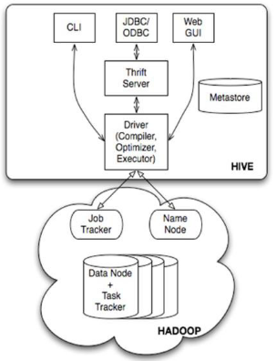
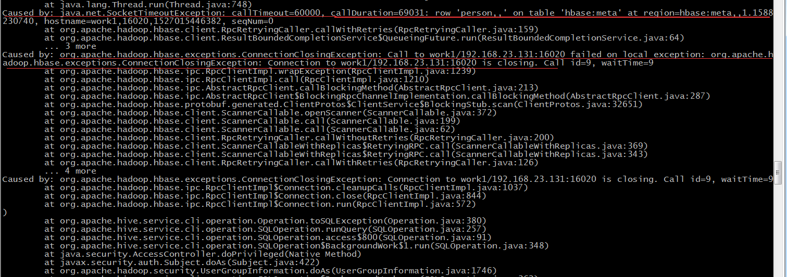

# 1. 安装
## 1.1 下载
wget https://mirrors.tuna.tsinghua.edu.cn/apache/hive/hive-1.2.2/apache-hive-1.2.2-bin.tar.gz

## 1.2 vim hive-site.xml
- cp conf/hive-default.xml.template conf/hive-site.xml，hive-site.xml配置如下：
```
<?xml version="1.0" encoding="UTF-8" standalone="no"?>
<?xml-stylesheet type="text/xsl" href="configuration.xsl"?>
<configuration>
<property>
	<name>javax.jdo.option.ConnectionURL</name>
	<value>jdbc:mysql://master:3306/hive?createDatabaseIfNotExist=true</value>
	<description>JDBC connect string for a JDBC metastore</description>
</property>
<property>
	<name>javax.jdo.option.ConnectionDriverName</name>
	<value>com.mysql.jdbc.Driver</value>
	<description>Driver class name for a JDBC metastore</description>
</property>
<property>
	<name>javax.jdo.option.ConnectionUserName</name>
	<value>hive</value>
	<description>username to use against metastore database</description>
</property>
<property>
	<name>javax.jdo.option.ConnectionPassword</name>
	<value>hive</value>
	<description>password to use against metastore database</description>
</property>

<property>
	<name>hive.metastore.warehouse.dir</name>
	<value>hdfs://master:9000/hive/warehouse</value>
</property>
<property>
	<name>hive.exec.scratchdir</name>
	<value>hdfs://master:9000/hive/scratchdir</value>
</property>

<property>
	<name>hive.server2.logging.operation.log.location</name>
	<value>/zz/data/hive/operation_logs</value>
	<description>Top level directory where operation logs are stored if logging functionality is enabled</description>
</property>
<property>
	<name>hive.exec.local.scratchdir</name>
	<value>/zz/data/hive/scratchdir</value>
	<description>Local scratch space for Hive jobs</description>
</property>
<property>
	<name>hive.downloaded.resources.dir</name>
	<value>/zz/data/hive/resources</value>
	<description>Temporary local directory for added resources in the remote file system.</description>
</property>
<property>
	<name>hive.querylog.location</name>        
	<value>/zz/data/hive/querylog</value>    
</property>
</configuration>
```

## 1.3 vim /etc/profile
```
export HIVE_HOME=/zz/app/hive
export PATH=$HIVE_HOME/bin:$PATH
```

## 1.4 hive-env.sh
- cp hive-env.sh.template hive-env.sh
```
export HADOOP_HOME=/zz/app/hadoop
export SPARK_HOME=/zz/app/spark
export HIVE_HOME=/zz/app/hive
export HIVE_CONF_DIR=/zz/app/hive/conf
```

## 1.5 hive-config.sh
- vim hive-config.sh
```
export JAVA_HOME=/zz/app/jdk
export HADOOP_HOME=/zz/app/hadoop
export SPARK_HOME=/zz/app/spark
export HIVE_HOME=/zz/app/hive
```

## 1.6 创建目录
```
#创建目录
hadoop fs -mkdir -p /hive/warehouse
hadoop fs -mkdir -p /hive/scratchdir

hdfs dfs -chmod g+w /hive/warehouse
hdfs dfs -chmod g+w /hive/scratchdir
hdfs dfs -chmod 777 /hive/scratchdir

#各节点都创建对应的目录
mkdir -p /zz/data/hive/operation_logs
mkdir -p /zz/data/hive/scratchdir
mkdir -p /zz/data/hive/resources
mkdir -p /zz/data/hive/querylog

chown -R hadoop:hadoop /zz/data/hive
chown -R hadoop:hadoop /zz/app/apache-hive-1.2.2-bin
```

## 1.7 添加mysql驱动
```
cd /zz/app/hive/lib
ln -s /zz/app/mysql-connector-java-5.1.45-bin.jar mysql-connector-java-5.1.45-bin.jar
/zz/shell/scp.sh lib/mysql-connector-java-5.1.45-bin.jar /zz/app/hive/lib/
```

## 1.8 创建mysql中hive用户
```
grant all privileges on *.* to hive@"%" identified by "hive" with grant option;
flush privileges;
```

## 1.9 替换hadoop低版本的jar包jline
```
mv hadoop/share/hadoop/yarn/lib/jline-0.9.94.jar hadoop/share/hadoop/yarn/lib/jline-0.9.94.jar.bak
cp hive/lib/jline-2.12.jar hadoop/share/hadoop/yarn/lib
```

## 1.9 启动测试
### 1.9.1 方式一单机的启动
- 启动：`nohup hive --service metastore -v &`
- 连接shell 客户端: `bin/hive`

### 1.9.2 作为服务启动
- 启动
  ```
  nohup /zz/app/hive/bin/hiveserver2 1 > /zz/app/hive/logs/hiveserver2.log 2>/zz/app/hive/logs/hiveserver2.error.log &
  ```
- 连接
  ```
  #master是服务器名
  bin/beeline -u jdbc:hive2://master:10000 -n hadoop
  ```

## 1.10 hive log配置
- 默认位置
  默认是在目录：/tmp/${user.name}
  如果hadoop用户启动的hive，则目录在/tmp/hadoop

- vim conf/hive-site.xml，修改下面的配置
  ```
  hive.log.dir=/zz/app/hive/logs
  ```


## 1.11 安装参考地址
https://www.jianshu.com/p/763d5c665a23
http://kevin12.iteye.com/blog/2280777
http://blog.csdn.net/linlinv3/article/details/49512587


# 2. 异常
## 2.1 启动异常
### 2.1.1 xml解析异常
```
org.xml.sax.SAXParseException: The markup in the document following the root element must be well-fo
```
处理：检查xml文件头

### 2.1.2 mysql驱动异常
```
javax.jdo.JDOFatalInternalException: Error creating transactional connection
```
处理：mysql驱动放到hive/lib下

### 2.1.3 hdfs权限问题
```
Exception in thread "main" java.lang.RuntimeException: java.lang.RuntimeException: The root scratch dir: hdfs://master:9000/hive/scratchdir on HDFS should be writable. Current permissions are: rwxrwxr-x
```
处理：hdfs dfs -chmod 777 /hive/scratchdir


### 2.1.4 jar包版本问题
```
ERROR] Terminal initialization failed; falling back to unsupported
java.lang.IncompatibleClassChangeError: Found class jline.Terminal, but interface was expected
```
- 处理：
  ```
  mv hadoop/share/hadoop/yarn/lib/jline-0.9.94.jar hadoop/share/hadoop/yarn/lib/jline-0.9.94.jar.bak
  cp hive/lib/jline-2.12.jar hadoop/share/hadoop/yarn/lib
  ```

### 2.1.5 启动无法加载spark jar包
- 问题：
  ```
  初次启动hive,解决 ls: cannot access /home/hadoop/spark-2.2.0-bin-hadoop2.6/lib/spark-assembly-*.jar: No such file or directory问题
  ```
- 处理：
  ```
  #修改前
  sparkAssemblyPath=`ls ${SPARK_HOME}/lib/spark-assembly-*.jar`
  #修改后
  sparkAssemblyPath=`ls ${SPARK_HOME}/jars/*.jar`
  ```

### 2.1.6 启动权限问题
- 异常信息
```
Caused by: java.lang.RuntimeException: org.apache.hadoop.ipc.RemoteException(org.apache.hadoop.security.authorize.AuthorizationException): User: hadoop is not allowed to impersonate hadoop
        at org.apache.hadoop.hive.ql.session.SessionState.start(SessionState.java:606) ~[hive-exec-2.3.3.jar:2.3.3]
        at org.apache.hadoop.hive.ql.session.SessionState.start(SessionState.java:544) ~[hive-exec-2.3.3.jar:2.3.3]
        at org.apache.hive.service.cli.session.HiveSessionImpl.open(HiveSessionImpl.java:164) ~[hive-service-2.3.3.jar:2.3.3]
        at sun.reflect.NativeMethodAccessorImpl.invoke0(Native Method) ~[?:1.8.0_121]
        at sun.reflect.NativeMethodAccessorImpl.invoke(NativeMethodAccessorImpl.java:62) ~[?:1.8.0_121]
        at sun.reflect.DelegatingMethodAccessorImpl.invoke(DelegatingMethodAccessorImpl.java:43) ~[?:1.8.0_121]
        at java.lang.reflect.Method.invoke(Method.java:498) ~[?:1.8.0_121]
        at org.apache.hive.service.cli.session.HiveSessionProxy.invoke(HiveSessionProxy.java:78) ~[hive-service-2.3.3.jar:2.3.3]
        at org.apache.hive.service.cli.session.HiveSessionProxy.access$000(HiveSessionProxy.java:36) ~[hive-service-2.3.3.jar:2.3.3]
        at org.apache.hive.service.cli.session.HiveSessionProxy$1.run(HiveSessionProxy.java:63) ~[hive-service-2.3.3.jar:2.3.3]
        at java.security.AccessController.doPrivileged(Native Method) ~[?:1.8.0_121]
        at javax.security.auth.Subject.doAs(Subject.java:422) ~[?:1.8.0_121]
        at org.apache.hadoop.security.UserGroupInformation.doAs(UserGroupInformation.java:1692) ~[hadoop-common-2.6.5.jar:?]
        at org.apache.hive.service.cli.session.HiveSessionProxy.invoke(HiveSessionProxy.java:59) ~[hive-service-2.3.3.jar:2.3.3]
        at com.sun.proxy.$Proxy37.open(Unknown Source) ~[?:?]
        at org.apache.hive.service.cli.session.SessionManager.createSession(SessionManager.java:410) ~[hive-service-2.3.3.jar:2.3.3]
        ... 13 more
Caused by: org.apache.hadoop.ipc.RemoteException: User: hadoop is not allowed to impersonate hadoop
        at org.apache.hadoop.ipc.Client.call(Client.java:1470) ~[hadoop-common-2.6.5.jar:?]
        at org.apache.hadoop.ipc.Client.call(Client.java:1401) ~[hadoop-common-2.6.5.jar:?]
        at org.apache.hadoop.ipc.ProtobufRpcEngine$Invoker.invoke(ProtobufRpcEngine.java:232) ~[hadoop-common-2.6.5.jar:?]
        at com.sun.proxy.$Proxy29.getFileInfo(Unknown Source) ~[?:?]
        at org.apache.hadoop.hdfs.protocolPB.ClientNamenodeProtocolTranslatorPB.getFileInfo(ClientNamenodeProtocolTranslatorPB.java:752) ~[hadoop-hdfs-2.6.5.jar:?]
        at sun.reflect.NativeMethodAccessorImpl.invoke0(Native Method) ~[?:1.8.0_121]
        at sun.reflect.NativeMethodAccessorImpl.invoke(NativeMethodAccessorImpl.java:62) ~[?:1.8.0_121]
        at sun.reflect.DelegatingMethodAccessorImpl.invoke(DelegatingMethodAccessorImpl.java:43) ~[?:1.8.0_121]
        at java.lang.reflect.Method.invoke(Method.java:498) ~[?:1.8.0_121]
        at org.apache.hadoop.io.retry.RetryInvocationHandler.invokeMethod(RetryInvocationHandler.java:187) ~[hadoop-common-2.6.5.jar:?]
        at org.apache.hadoop.io.retry.RetryInvocationHandler.invoke(RetryInvocationHandler.java:102) ~[hadoop-common-2.6.5.jar:?]
        at com.sun.proxy.$Proxy30.getFileInfo(Unknown Source) ~[?:?]
        at org.apache.hadoop.hdfs.DFSClient.getFileInfo(DFSClient.java:1977) ~[hadoop-hdfs-2.6.5.jar:?]
        at org.apache.hadoop.hdfs.DistributedFileSystem$18.doCall(DistributedFileSystem.java:1118) ~[hadoop-hdfs-2.6.5.jar:?]
        at org.apache.hadoop.hdfs.DistributedFileSystem$18.doCall(DistributedFileSystem.java:1114) ~[hadoop-hdfs-2.6.5.jar:?]
        at org.apache.hadoop.fs.FileSystemLinkResolver.resolve(FileSystemLinkResolver.java:81) ~[hadoop-common-2.6.5.jar:?]
        at org.apache.hadoop.hdfs.DistributedFileSystem.getFileStatus(DistributedFileSystem.java:1114) ~[hadoop-hdfs-2.6.5.jar:?]
        at org.apache.hadoop.fs.FileSystem.exists(FileSystem.java:1400) ~[hadoop-common-2.6.5.jar:?]
        at org.apache.hadoop.hive.ql.session.SessionState.createRootHDFSDir(SessionState.java:704) ~[hive-exec-2.3.3.jar:2.3.3]
        at org.apache.hadoop.hive.ql.session.SessionState.createSessionDirs(SessionState.java:650) ~[hive-exec-2.3.3.jar:2.3.3]
        at org.apache.hadoop.hive.ql.session.SessionState.start(SessionState.java:582) ~[hive-exec-2.3.3.jar:2.3.3]
        at org.apache.hadoop.hive.ql.session.SessionState.start(SessionState.java:544) ~[hive-exec-2.3.3.jar:2.3.3]
        at org.apache.hive.service.cli.session.HiveSessionImpl.open(HiveSessionImpl.java:164) ~[hive-service-2.3.3.jar:2.3.3]
        at sun.reflect.NativeMethodAccessorImpl.invoke0(Native Method) ~[?:1.8.0_121]
        at sun.reflect.NativeMethodAccessorImpl.invoke(NativeMethodAccessorImpl.java:62) ~[?:1.8.0_121]
        at sun.reflect.DelegatingMethodAccessorImpl.invoke(DelegatingMethodAccessorImpl.java:43) ~[?:1.8.0_121]
        at java.lang.reflect.Method.invoke(Method.java:498) ~[?:1.8.0_121]
        at org.apache.hive.service.cli.session.HiveSessionProxy.invoke(HiveSessionProxy.java:78) ~[hive-service-2.3.3.jar:2.3.3]
        at org.apache.hive.service.cli.session.HiveSessionProxy.access$000(HiveSessionProxy.java:36) ~[hive-service-2.3.3.jar:2.3.3]
        at org.apache.hive.service.cli.session.HiveSessionProxy$1.run(HiveSessionProxy.java:63) ~[hive-service-2.3.3.jar:2.3.3]
        at java.security.AccessController.doPrivileged(Native Method) ~[?:1.8.0_121]
        at javax.security.auth.Subject.doAs(Subject.java:422) ~[?:1.8.0_121]
        at org.apache.hadoop.security.UserGroupInformation.doAs(UserGroupInformation.java:1692) ~[hadoop-common-2.6.5.jar:?]
        at org.apache.hive.service.cli.session.HiveSessionProxy.invoke(HiveSessionProxy.java:59) ~[hive-service-2.3.3.jar:2.3.3]
        at com.sun.proxy.$Proxy37.open(Unknown Source) ~[?:?]
        at org.apache.hive.service.cli.session.SessionManager.createSession(SessionManager.java:410) ~[hive-service-2.3.3.jar:2.3.3]
        ... 13 more
```
- 处理
  - 参考地址：[https://my.oschina.net/gently/blog/683604](https://my.oschina.net/gently/blog/683604)
  - core-site.xml 文件添加下面配置
```
<property>
	<name>hadoop.proxyuser.hadoop.hosts</name>                                               
    	<value>*</value>
</property>

<property>
    	<name>hadoop.proxyuser.hadoop.groups</name>
    	<value>*</value>
</property>
```

## 2.2 改hive版本时, 元数据异常

- 异常信息：
  ```
  Caused by: MetaException(message:Hive Schema version 2.1.0 does not match metastore's schema version 1.2.0 Metastore is not upgraded or corrupt)
  ```
- 处理：
  参考地址：https://www.cnblogs.com/liupuLearning/p/6610307.html
  ```
  #(1)删除HDFS上的hive数据与hive数据库
  hadoop fs -rm -r -f /tmp/hive
  hadoop fs -rm -r -f /user/hive

  #(2)删除MySQL上的hive的元数据信息
  mysql -uroot -p 
  drop database hive

  #(3)初始化hive, 将mysql作为hive的元数据库
  schematool -dbType mysql -initSchema 
  ```


# 3 Hive架构

## 3.1


- 解析sql，得到语法树，根据语法树找对应的mapreduce模版，然后把它组装起来
- 它有内部的优化机制：
  - 例如join操作: 以join的条件作为key，把2个表的数据发到reduce，然后在reduce端做聚合
  - 如果2个表join的时候，有一个表很小（有阈值，小于这个值），自动开启map端的join操作（把小表的数据加载到内存中）map端出结果
- 组装无非就是：传入一些参数，你的数据在哪里，你表数据的分隔符是什么，你的文件格式是什么（这些在建表的时候就指定了，它都知道，就可以跑起来了）


# 4. Hive使用

## 4.1 sort by 和 order by
- 使用`sort by` 取最大值，是有问题的，可能是分多个区，再用 `limit 1` 就会有问题；Sort By，它通常发生在每一个redcue里，只是保证了输出的部分有序
- 使用 `order by` 是全局有序的 ，再使用 `limit 1`
- Order By ，在strict 模式下（hive.mapred.mode=strict),order by 语句必须跟着limit语句，但是在nonstrict下就不是必须的，这样做的理由是必须有一个reduce对最终的结果进行排序，如果最后输出的行数过多，一个reduce需要花费很长的时间。
  - `hive> set hive.mapred.mode=strict;`   #<默认nonstrict>

## 4.2 保存select查询结果3种方式
- 将查询结果保存到一张新的hive表中
  ```
  create table t_tmp
  as
  select * from t_p;
  ```

- 将查询结果保存到一张已经存在的hive表中
  ```
  insert into  table t_tmp
  select * from t_p;
  ```

- 将查询结果保存到指定的文件目录（可以是本地，也可以是hdfs）
  ```
  insert overwrite local directory '/home/hadoop/test'
  select * from t_p;

  #hdfs上
  insert overwrite directory '/aaa/test'
  select * from t_p;
  ```

## 4.3 自定义UDF
- 先开发一个java类，继承UDF，并重载evaluate方法
  ```
  package cn.itcast.bigdata.udf
  import org.apache.hadoop.hive.ql.exec.UDF;
  import org.apache.hadoop.io.Text;

  public final class Lower extends UDF{
  	public Text evaluate(final Text s){
  		if(s==null){return null;}
  		return new Text(s.toString().toLowerCase());
  	}
  }
  ```
- 打成jar包上传到服务器
- 将jar包添加到hive的classpath
  - `hive>add JAR /home/hadoop/udf.jar;`
- 创建临时函数与开发好的java class关联
  - `Hive>create temporary function toprovince as 'cn.itcast.bigdata.udf.ToProvince';`
- 即可在hql中使用自定义的函数
  - `Select toprovince (name),age from t_test;`

## 4.4 UDF案例
### 4.4.1 json数据分字段入表
- 日志
  `{"movie":"1721","rate":"3","timeStamp":"965440048","uid":"5114"}`
- 开发UDF
  - MovieRateBean.java
    ```
    package cn.itcast.bigdata.udf;

    //{"movie":"1721","rate":"3","timeStamp":"965440048","uid":"5114"}
    public class MovieRateBean {

    	private String movie;
    	private String rate;
    	private String timeStamp;
    	private String uid;
    	public String getMovie() {
    		return movie;
    	}
    	public void setMovie(String movie) {
    		this.movie = movie;
    	}
    	public String getRate() {
    		return rate;
    	}
    	public void setRate(String rate) {
    		this.rate = rate;
    	}
    	public String getTimeStamp() {
    		return timeStamp;
    	}
    	public void setTimeStamp(String timeStamp) {
    		this.timeStamp = timeStamp;
    	}
    	public String getUid() {
    		return uid;
    	}
    	public void setUid(String uid) {
    		this.uid = uid;
    	}
    	@Override
    	public String toString() {
    		return movie + "\t" + rate + "\t" + timeStamp + "\t" + uid;
    	}
    }

    ```
  - JsonParser.java
    ```
    package cn.itcast.bigdata.udf;

    import org.apache.hadoop.hive.ql.exec.UDF;

    import parquet.org.codehaus.jackson.map.ObjectMapper;

    public class JsonParser extends UDF {

    	public String evaluate(String jsonLine) {

    		ObjectMapper objectMapper = new ObjectMapper();

    		try {
    			MovieRateBean bean = objectMapper.readValue(jsonLine, MovieRateBean.class);
    			return bean.toString();
    		} catch (Exception e) {

    		}
    		return "";
    	}

    }
    ```
- 处理数据到表里
  ```
  #先把原始数据加载到一个表里（字段是json字符串）
  create table rat_json(line string) row format delimited;
  load data local inpath '/home/hadoop/rating.json' into table rat_json;

  #创建放分字段的表
  drop table if exists t_rating;
  create table t_rating(movieid string,rate int,timestring string,uid string)
  row format delimited fields terminated by '\t';

  #利用自带的split函数处理解析后的json数据（自定义的UDF中解析json，并拼接成\t分隔的字符串）
  insert overwrite table t_rating
  select split(parsejson(line),'\t')[0]as movieid,split(parsejson(line),'\t')[1] as rate,split(parsejson(line),'\t')[2] as timestring,split(parsejson(line),'\t')[3] as uid from rat_json limit 10;
  ```

### 4.4.2 使用内置jason函数
- 使用内置函数替代上面的自定义UDF
```
select get_json_object(line,'$.movie') as moive,get_json_object(line,'$.rate') as rate  from rat_json limit 10;
```

## 4.5 导入数据到hive中
  ```
create table temp(id string, name string, age string, sex string, birthday string) row format delimited fields terminated by '\t' lines terminated by '\n' stored as textfile location '/data/data';
  
create table temp(id string, name string, age string, sex string, birthday string) row format DELIMITED FIELDS TERMINATED BY '\t' ;

#加载数据
load data local inpath '/home/hadoop/usertest' into table temp;
  ```

## 4.6 java jdbc 连接hive
### 4.6.1 资源地址
- 参考地址
  - https://blog.csdn.net/lovelovelovelovelo/article/details/71203605
  - https://blog.csdn.net/fightxxl55/article/details/52972312

- 官网：
  - https://hive.apache.org/
  - 配置：https://cwiki.apache.org/confluence/display/Hive/HiveServer2+Clients#HiveServer2Clients-JDBC
  - hive老版本的事例：https://cwiki.apache.org/confluence/display/Hive/HiveClient#HiveClient-JDBCClientSetupforaSecureCluster
  - HiveServer 2：https://cwiki.apache.org/confluence/display/Hive/HiveServer2+Overview#HiveServer2Overview-JDBCClient

### 4.6.2 实现
- 配置，修改 `conf/hive-site.xml` 文件，添加下面内容
  ```
  <property>
          <name>hive.server2.thrift.port</name>
          <value>10000</value>
  </property>
  <property>
          <name>hive.server2.thrift.bind.host</name>
          <value>work2</value>
  </property>
  ```

- 代码，JDBCConnectHive.java
  ```
  /**
   * 使用jdbc连接hive2
   */
  public class JDBCConnectHive {

  	private static String driverName = "org.apache.hive.jdbc.HiveDriver";

  	public static void main(String[] args) throws Exception{
  		try {
  			Class.forName(driverName);
  		} catch (ClassNotFoundException e) {
  			// TODO Auto-generated catch block
  			e.printStackTrace();
  			System.exit(1);
  		}

  		Connection con = DriverManager.getConnection("jdbc:hive2://192.168.23.132:10000/default", "hadoop", "hadoop");
  		Statement stmt = con.createStatement();
  		stmt.execute("use default");
  		ResultSet res = null;
  		String sql = null;

  		String tableName = "testHiveDriverTable";
  		// DLL语句（如，create 、 alter 、drop、add jar 等）应该调用stmt.execute()，这类操作不会返回查询结果集。
  		// DML语句（如， select）应该调用stmt.executeQuery()，这类操作会返回结果集。
  		// 否则会有异常： java.sql.SQLException: The query did not generate a result set!
  		stmt.execute("drop table " + tableName);
  		stmt.execute("create table " + tableName + " (key int, value string) row format DELIMITED FIELDS TERMINATED BY '\\t'");

  		// show tables
  //		sql = "show tables '" + tableName + "'";
  		sql = "show tables";
  		System.out.println("Running: " + sql);
  		res = stmt.executeQuery(sql);
  		while (res.next()){
  			System.out.println(res.getString(1));
  		}
  		/*if (res.next()) {
  			System.out.println(res.getString(1));
  		}*/

  		// describe table
  		sql = "describe " + tableName;
  		System.out.println("Running: " + sql);
  		res = stmt.executeQuery(sql);
  		while (res.next()) {
  			System.out.println(res.getString(1) + "\t" + res.getString(2));
  		}

  		// load data into table
  		// NOTE: filepath has to be local to the hive server
  		// NOTE: /tmp/a.txt is a ctrl-A separated file with two fields per line
  		String filepath = "/home/hadoop/usertest2";
  		sql = "load data local inpath '" + filepath + "' into table " + tableName;
  		System.out.println("Running: " + sql);
  		stmt.execute(sql);

  		/**
  		 * hive_hbase	hive创建的关联hbase的表，连接失败
  		 person_hbase	hbase的表，hive去关联的，连接失败
  		 temp			hive创建的独立的表，连接成功
  		 testhivedrivertable
  		 */
  		List<String> listTable = new ArrayList<String>();
  //		listTable.add("hive_hbase");
  //		listTable.add("person_hbase");
  		listTable.add("temp");
  		for (String table: listTable) {
  			// select * query
  			sql = "select * from " + table;
  			System.out.println("Running: " + sql);
  			res = stmt.executeQuery(sql);
  			while (res.next()) {
  				System.out.println(String.valueOf(res.getInt(1)) + "\t" + res.getString(2));
  			}
  			System.out.println("--------------------------------");
  		}

  //System.exit(0);

  		// select * query
  		sql = "select * from " + tableName;
  		System.out.println("Running: " + sql);
  		res = stmt.executeQuery(sql);
  		while (res.next()) {
  			System.out.println(String.valueOf(res.getInt(1)) + "\t" + res.getString(2));
  		}

  		// regular hive query
  		sql = "select count(1) from " + tableName;
  		System.out.println("Running: " + sql);
  		res = stmt.executeQuery(sql);
  		while (res.next()) {
  			System.out.println(res.getString(1));
  		}
  	}
  }
  ```

### 4.6.3 出现的异常
#### 4.6.3.1 连接hive2服务异常
- 异常信息：
```
Exception in thread "main" java.sql.SQLException: Could not open client transport with JDBC Uri: jdbc:hive2://work2:10000/default: java.net.ConnectException: Connection refused: connect
```
- 处理：
  - 配置文件中 `hive-site.xml` 添加下面内容
    ```
    <property>
            <name>hive.server2.thrift.port</name>
            <value>10000</value>
    </property>
    <property>
            <name>hive.server2.thrift.bind.host</name>
            <value>work2</value>
    </property>
    ```
  - 连接处理
    ```
    #连接中使用ip（使用主机名出问题了，host已配置）
    jdbc:hive2://192.168.23.132:10000/default
    ```

#### 4.6.3.2 权限问题
- 异常信息：
  ```
  Exception in thread "main" java.sql.SQLException: Could not open client transport with JDBC Uri: jdbc:hive2://192.168.23.132:10000/default: Failed to open new session: java.lang.RuntimeException: org.apache.hadoop.ipc.RemoteException(org.apache.hadoop.security.authorize.AuthorizationException): User: hadoop is not allowed to impersonate hive
  ```
- 处理：
  ```
  #连接时使用hadoop用户
  Connection con = DriverManager.getConnection("jdbc:hive2://192.168.23.132:10000/default", "hadoop", "hadoop");
  ```

#### 4.6.3.3 sql 执行异常
- 异常信息：
  ```
  java.sql.SQLException: The query did not generate a result set!
  ```
- 处理：
  参考：https://zhidao.baidu.com/question/1112416146552145459.html
  - DLL语句（如，create 、 alter 、drop、add jar 等）应该调用stmt.execute()，这类操作不会返回查询结果集。
  - DML语句（如， select）应该调用stmt.executeQuery()，这类操作会返回结果集。

#### 4.6.3.4 连接hive关联hbase的表异常
- 异常信息：
  ```
  Exception in thread "main" org.apache.hive.service.cli.HiveSQLException: java.io.IOException: org.apache.hadoop.hbase.client.RetriesExhaustedException: Failed after attempts=36, exceptions:
  Thu May 24 13:46:34 CST 2018, null, java.net.SocketTimeoutException: callTimeout=60000, callDuration=68651: Call to work1/192.168.23.131:16020 failed on connection exception: java.net.ConnectException: Connection refused row 'person,,00000000000000' on table 'hbase:meta' at region=hbase:meta,,1.1588230740, hostname=work1,16020,1527087798324, seqNum=0
  ```
- 暂时没找到处理方法
  beeline 好像暂时还不支持这种

##4.7 hive中递增
- 按年龄递增的编号做 `person_hbase` 的id 并插入数据
  ```
  insert into person_hbase select row_number() over(order by age),name,age,sex as birthday from usertest;
  ```

# 5. hive关联Hbase
## 5.1 关联配置
- 环境：
  hadoop-2.7.6
  hbase-1.4.4
  apache-hive-2.3.3-bin

- 在使用过程中发现
  hive2.x 不建议使用mr引擎，建议使用spark引擎；如果使用mr请使用hive1.x版本

- 参考地址：
  https://blog.csdn.net/xiaoshunzi111/article/details/51803719
  https://www.cnblogs.com/bujunpeng/p/4788279.html
  https://blog.csdn.net/lr131425/article/details/72722932
  https://blog.csdn.net/liuxiao723846/article/details/69808450
  https://www.cnblogs.com/tgzhu/p/5764035.html
  https://blog.csdn.net/a2011480169/article/details/51588253
  https://blog.csdn.net/scutshuxue/article/details/6988348
  https://www.cnblogs.com/DamianZhou/p/4049281.html

- jar包
  复制hbase中lib目录下的 `hbase*` `zookeeper*` 到hive的lib目录下，用的hive和hbase这个版本的，hbae的包hive都有了

- 修改配置文件
  ```
  <property>  
  	<name>hive.aux.jars.path</name>  
  	<value>file:///zz/app/hive/lib/hbase-annotations-1.4.4.jar,file:///zz/app/hive/lib/hbase-annotations-1.4.4-tests.jar,file:///zz/app/hive/lib/hbase-client-1.4.4.jar,file:///zz/app/hive/lib/hbase-common-1.4.4.jar,file:///zz/app/hive/lib/hbase-common-1.4.4-tests.jar,file:///zz/app/hive/lib/hbase-examples-1.4.4.jar,file:///zz/app/hive/lib/hbase-external-blockcache-1.4.4.jar,file:///zz/app/hive/lib/hbase-hadoop2-compat-1.4.4.jar,file:///zz/app/hive/lib/hbase-hadoop-compat-1.4.4.jar,file:///zz/app/hive/lib/hbase-it-1.4.4.jar,file:///zz/app/hive/lib/hbase-it-1.4.4-tests.jar,file:///zz/app/hive/lib/hbase-metrics-1.4.4.jar,file:///zz/app/hive/lib/hbase-metrics-api-1.4.4.jar,file:///zz/app/hive/lib/hbase-prefix-tree-1.4.4.jar,file:///zz/app/hive/lib/hbase-procedure-1.4.4.jar,file:///zz/app/hive/lib/hbase-protocol-1.4.4.jar,file:///zz/app/hive/lib/hbase-resource-bundle-1.4.4.jar,file:///zz/app/hive/lib/hbase-rest-1.4.4.jar,file:///zz/app/hive/lib/hbase-rsgroup-1.4.4.jar,file:///zz/app/hive/lib/hbase-server-1.4.4.jar,file:///zz/app/hive/lib/hbase-server-1.4.4-tests.jar,file:///zz/app/hive/lib/hbase-shell-1.4.4.jar,file:///zz/app/hive/lib/hbase-thrift-1.4.4.jar</value>
  </property>
  <property>
    <name>hive.zookeeper.quorum</name>
    <value>master,work1,work2</value>
  </property>
  ```

- 重启hive
  ```
  nohup /zz/app/hive/bin/hiveserver2 1 > /zz/app/hive/logs/hiveserver2.log 2>/zz/app/hive/logs/hiveserver2.error.log &
  ```
## 5.2 表关联
- 连接hive，一定要是hive，不是beeline（会有问题）
  ```
  ./bin/hive
  ```
- hbase中已经存在的表，hive去关联
  ```
  #全部字段
  CREATE EXTERNAL TABLE person_hbase(key string, name string, age int, birthday string) STORED BY 'org.apache.hadoop.hive.hbase.HBaseStorageHandler' WITH SERDEPROPERTIES ("hbase.columns.mapping" = ":key, cf1:name, cf1:age, cf1:birthday") TBLPROPERTIES("hbase.table.name" = "person");

  #只有部分字段
  CREATE EXTERNAL TABLE person_hbase(key string, name string, age int) STORED BY 'org.apache.hadoop.hive.hbase.HBaseStorageHandler' WITH SERDEPROPERTIES ("hbase.columns.mapping" = ":key, cf1:name, cf1:age") TBLPROPERTIES("hbase.table.name" = "person");
  ```
- hbase中没有的表，在hive中创建
  ```
  #创建表
  create table hive_hbase(id string,name string, age int, sex string) stored by 'org.apache.hadoop.hive.hbase.HBaseStorageHandler' with serdeproperties ("hbase.columns.mapping" = ":key,cf1:name,cf1:age, cf1:sex") tblproperties ("hbase.table.name" = "hive");

  #导入数据
  insert into hive_hbase select * from temp;
  ```
- 导入玩,就可以在hbase\hive 中查到了

## 5.3 在使用中遇到的问题
- 现象
  

- 原因：
  使用beeline客户端去连接hive，然后去关联表；换用 `./bin/hive` 去关联表

