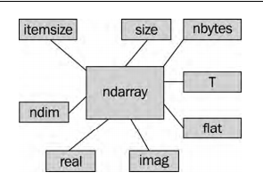

# 1. python数据分析基础-Numpy
## 1.1 numpy介绍
- NumPy（Numerical Python的缩写）是一个开源的Python科学计算库
- 使用NumPy，就可以很自然地使用数组和矩阵。 NumPy包含很多实用的数学函数，涵盖线性代数运算、傅里叶变换和随机数生成等功能。
- NumPy能够直接对数组和矩阵进行操作，可以省略很多循环语句，其众多的数学函数也会让编写代码的工作轻松许多。
- NumPy的大部分代码都是用C语言写成的，这使得NumPy比纯Python代码高效得多。 
- 在 Windows 上安装 NumPy、 Matplotlib、SciPy 和 IPython
  - (1) 从SourceForge网站下载NumPy的Windows安装程序：
    http://sourceforge.net/projects/numpy/files/
    请选择合适的版本。在上图中，我们选择了numpy-1.7.0-win32-superpack-python2.7.exe。
  - (2) 下载完成后，双击运行安装程序。
    SciPy和Matplotlib可以通过Enthough安装，地址为www.enthought.com/products/epd.php。
    在安装过程中，你可能需要将一个文件msvcp71.dll放到目录C:\Windows\system32下。
    你可以从这里下载这个文件： www.dll-files.com/dllindex/dll-files.shtml?msvcp71。 
    Windows下的IPython安装程序可以通过访问IPython的官网下载： http://ipython.scipy.org/Wiki/IpythonOnWindows。
- 在 Linux 上安装 NumPy、 Matplotlib、 SciPy和 IPython
  - (1) 要在Red Hat上安装NumPy，请在命令行中执行如下命令：
    `yum install python-numpy`
- numpy简单使用
  ```python
  import numpy as np
  a = np.arange(n) ** 2
  b = np.arange(n) ** 3
  c = a + b
  ```

## 1.2 NumPy 数组基础
### 1.2.1 多维数组
- NumPy中的ndarray是一个多维数组对象，该对象由两部分组成：
  - 实际的数据；
  - 描述这些数据的元数据。
    大部分的数组操作仅仅修改元数据部分，而不改变底层的实际数据

- 使用arange函数创建的数组只是包含一组数字的一维数组，而ndarray支持更高的维度。
- NumPy数组一般是同质的，即数组中的所有元素类型必须是一致的。
- 与Python中一样， NumPy数组的下标也是从0开始的。
  ```python
  m = array([arange(2), arange(2)]) # array([[0, 1],[0, 1]])
  m.shape #(2, 2)

  #选取数组元素
  a = array([[1,2],[3,4]]) #array([[1, 2],[3, 4]])
  a[0,1] #2
  ```

### 1.2.2 数据类型：

| 类 型                | 描 述                      |
| ------------------ | ------------------------ |
| bool               | 用一位存储的布尔类型（值为TRUE或FALSE） |
| inti               | 由所在平台决定其精度的整数（一般为int32或i |
| int8               | 整数，范围为128至127           |
| int16              | 整数，范围为32 768至32 767     |
| int32              | 整数，范围为231至231 1        |
| int64              | 整数，范围为263至263 1        |
| uint8              | 无符号整数，范围为0至255           |
| uint16             | 无符号整数，范围为0至65 535        |
| uint32             | 无符号整数，范围为0至2321         |
| uint64             | 无符号整数，范围为0至2641         |
| float16            | 半精度浮点数（16位）：其中用1位表示正负号，  |
| float32            | 单精度浮点数（32位）：其中用1位表示正负号，  |
| float64或float      | 双精度浮点数（64位）：其中用1位表示正负号，  |
| complex64          | 复数，分别用两个32位浮点数表示实部和虚部    |
| complex128或complex | 复数，分别用两个64位浮点数表示实部和虚部    |

- 在NumPy中，许多函数的参数中可以指定数据类型，通常这个参数是可选的：
  `arange(7, dtype=uint16) #array([0, 1, 2, 3, 4, 5, 6], dtype=uint16)`

- 数据类型对象可以给出单个数组元素在内存中占用的字节数，即dtype类的itemsize属性：
  `a.dtype.itemsize #8`

### 1.2.3 字符编码
| 数据类型       | 字符编码 |
| ---------- | ---- |
| 整数         | i    |
| 无符号整数      | u    |
| 单精度浮点数     | f    |
| 双精度浮点数     | d    |
| 布尔值        | b    |
| 复数         | D    |
| 字符串        | S    |
| unicode字符串 | U    |
| void （空）   | V    |

- 下面的代码创建了一个单精度浮点数数组：
```python
In: arange(7, dtype='f')
Out: array([ 0., 1., 2., 3., 4., 5., 6.], dtype=float32)
```
- 与此类似，还可以创建一个复数数组：
```python
In: arange(7, dtype='D')
Out: array([ 0.+0.j, 1.+0.j, 2.+0.j, 3.+0.j, 4.+0.j, 5.+0.j, 6.+0.j])
```

### 1.2.4 一维数组的索引和切片
- 取3~6
```python
In: a = arange(9)
In: a[3:7]
Out: array([3, 4, 5, 6])
```
- 也可以用下标0~7，以2为步长选取元素：
```python
In: a[:7:2]
Out: array([0, 2, 4, 6])
```
- 和Python中一样，我们也可以利用负数下标翻转数组：
```python
In: a[::-1]
Out: array([8, 7, 6, 5, 4, 3, 2, 1, 0])
```
- 用arange函数创建一个数组并改变其维度，使之变成一个三维数组：
- ndarray支持在多维数组上的切片操作。为了方便起见，我们可以用一个省略号（...）来表示遍历剩下的维度。
- reshape函数的作用是改变数组的“形状”，也就是改变数组的维度，其参数为一个正整数元组，分别指定数组在每个维度上的大小。如果指定的维度和数组的元素数目不相吻合，函数将抛出异常。
  ```python
  b = arange(24).reshape(2,3,4)
  #array([
  #			[[ 0, 1, 2, 3],[ 4, 5, 6, 7],[ 8, 9,10,11]],
  #			[[12, 13, 14, 15],[16, 17, 18, 19],[20, 21, 22, 23]]
  #		])
  b.shape #(2, 3, 4)
  ```

- 元素选取
  ```python
  In: b[0,0,0]
  Out: 0

  b[:,0,0]
  b[0, :, :]
  #多个冒号可以用一个省略号（...）来代替，因此上面的代码等价于：
  b[0, ...]

  b[0,1] #array([4, 5, 6, 7])
  #在上面的数组切片中间隔地选定元素：
  b[0,1,::2] #array([4, 6])
  b[...,1] #array([[ 1, 5, 9],[13,17,21]])
  b[:,1] #array([[ 4, 5, 6, 7],[16,17,18,19]])
  b[0,:,1] #array([1, 5, 9])
  #第1层楼的最后一列的所有房间
  b[0,:,-1] #array([ 3, 7, 11])
  #反向选取第1层楼的最后一列的所有
  b[0,::-1, -1] #array([11, 7, 3])
  #在该数组切片中间隔地选定元素：
  b[0,::2,-1] #array([ 3, 11])
  #在多维数组中执行翻转一维数组
  b[::-1] #array([[[12,13,14,15],[16,17,18,19],[20,21,22,23],
  			[[ 0, 1, 2, 3],[ 4, 5, 6, 7],[ 8, 9,10,11]]])
  ```

### 1.2.5 改变数组的维度
1. ravel 我们可以用ravel函数完成展平的操作：
  ```python
  b #array([[[ 0, 1, 2, 3],[ 4, 5, 6, 7],[ 8, 9,10,11]],
  		[[12,13,14,15],[16,17,18,19],[20,21,22,23]]])
  b.ravel() #array([ 0, 1, 2, 3, 4, 5, 6, 7, 8, 9, 10, 11, 12, 13, 14, 15, 16,17, 18, 19, 20, 21, 22, 23])
  ```
2. flatten 这个函数恰如其名， flatten就是展平的意思，与ravel函数的功能相同。不过，flatten函数会请求分配内存来保存结果，而ravel函数只是返回数组的一个视图（view）：
  ```python
  b.flatten() #array([ 0, 1, 2, 3, 4, 5, 6, 7, 8, 9, 10, 11, 12, 13, 14, 15, 16,17, 18, 19, 20, 21, 22, 23])
  ```
3. 用元组设置维度 除了可以使用reshape函数，我们也可以直接用一个正整数元组来设置数组的维度
  ```python
  b.shape = (6,4) #array([ 0, 1, 2, 3],[ 4, 5, 6, 7],[ 8, 9,10,11],[12,13,14,15],[16,17,18,19],[20,21,22,23]],
  ```
4. transpose 在线性代数中， 转置矩阵是很常见的操作。
  ```python
  b.transpose() #array([[ 0, 4, 8, 12, 16, 20],[ 1, 5, 9, 13, 17, 21],[ 2, 6,10, 14, 18, 22],[ 3, 7,11, 15, 19, 23]])
  ```
5. resize resize和reshape函数的功能一样，但resize会直接修改所操作的数组：
  ```python
  b.resize((2,12)) #array([[ 0, 1, 2, 3, 4, 5, 6, 7, 8, 9, 10, 11],[12,13,14,15,16,17,18,19,20,21, 22, 23]])
  ```

### 1.2.6 数组的组合
- NumPy数组有水平组合、垂直组合和深度组合等多种组合方式，我们将使用vstack、dstack、 hstack、 column_stack、 row_stack以及concatenate函数来完成数组的组合
  ```python
  a = arange(9).reshape(3,3) # array([[0, 1, 2],[3, 4, 5],[6, 7, 8]])
  b = 2 * a # array([[ 0, 2, 4],[ 6, 8, 10],[12, 14,16]])
  ```

1. 水平组合`hstack`

  ```python
  hstack((a, b)) #array([[ 0, 1, 2, 0, 2, 4],[ 3, 4, 5, 6, 8,10],[ 6, 7, 8,12,14,16]])
  #也可以用concatenate函数来实现同样的效果
  concatenate((a, b), axis=1) #array([[ 0, 1, 2, 0, 2, 4],[ 3, 4, 5, 6, 8,10],[ 6, 7, 8,12,14,16]])
  ```

2. 垂直组合`vstack`
  ```python
  vstack((a, b)) #array([[ 0, 1, 2],[ 3, 4, 5],[ 6, 7, 8],[ 0, 2, 4],[ 6, 8,10],[12,14,16]])
  # 我们将concatenate函数的axis参数设置为0即可实现同样的效果。这也是axis参数的默认值：
  concatenatel((a, b), axis = 0)
  ```

3. 深度组合`dstack`
  ```python
  dstack((a, b))
  #array([[[0, 0],[1, 2],[2, 4]],
  #		[[3, 6],[4, 8],[5,10]],
  #		[[6,12],[7,14],[8,16]]])
  ```

4. 列组合`column_stack`
  ```python
  oned = arange(2)
  twice_oned = 2 * oned
  column_stack((oned, twice_oned)) #array([[0, 0],[1, 2]])
  
  #而对于二维数组， column_stack与hstack的效果是相同的：
  column_stack((a, b)) #array([[ 0, 1, 2, 0, 2, 4],[ 3, 4, 5, 6, 8,10],[ 6, 7, 8,12,14,16]])
  ```

5. 行组合 `row_stack`
  ```python
  row_stack((oned, twice_oned))array([[0, 1],[0, 2]])
  
  #对于二维数组， row_stack与vstack的效果是相同的：
  row_stack((a, b)) #array([[ 0, 1, 2],[ 3, 4, 5],[ 6, 7, 8],[ 0, 2, 4],[ 6, 8,10],[12,14,16]])
  ```

### 1.2.7  数组的分割
- NumPy数组可以进行水平、垂直或深度分割，相关的函数有hsplit、 vsplit、 dsplit和split。我们可以将数组分割成相同大小的子数组，也可以指定原数组中需要分割的位置。
1. 水平分割 `hsplit`
  ```python
  a #array([[0, 1, 2],[3, 4, 5],[6, 7, 8]])
  hsplit(a, 3) # [array([[0],[3],[6]]),array ([[1],[4],[7]]),array ([[2],[5],[8]])]
  
  # 对同样的数组，调用split函数并在参数中指定参数axis=1
  split(a, 3, axis=1) # [array([[0],[3],[6]]),array ([[1],[4],[7]]),array ([[2],[5],[8]])]
  ```

2. 垂直分割 vsplit
  ```python
  vsplit(a, 3) #[array([[0, 1, 2]]), array([[3, 4, 5]]), array([[6, 7, 8]])]
  
  #调用split函数并在参数中指定参数axis=0，也可以得到同样的结果：
  split(a, 3, axis=0) #[array([[0, 1, 2]]), array([[3, 4, 5]]), array([[6, 7, 8]])]
  ```

3. 深度分割 `dsplit`
  ```python
  b ##array([[[ 0,  1,  2,  3],
    #      [ 4,  5,  6,  7],
    #      [ 8,  9, 10, 11]],
    #     [[12, 13, 14, 15],
    #      [16, 17, 18, 19],
    #      [20, 21, 22, 23]]])
  np.dsplit(b, 4) #[array([[[ 0],[ 4],[ 8]],
					#		[[12],[16],[20]]]), 
					#array([[[ 1],[ 5],[ 9]],
					#	[[13],[17],[21]]]), 
					#array([[[ 2],[ 6],[10]],
					#	[[14],[18],[22]]]), 
					#array([[[ 3],[ 7],[11]],
					#	[[15],[19],[23]]])]
  ```

### 1.2.8 数组的属性
- 除了shape和dtype属性以外， ndarray对象还有很多其他的属性
1. ndim属性，给出数组的维数，或数组轴的个数：
```python
  b #array([[0, 1, 2, 3, 4, 5, 6, 7, 8, 9, 10,11],[12,13,14,15,16,17,18,19,20,21,22,23]])
  b.ndim #2
```

2. size属性，给出数组元素的总个数
  ```python
  b.size #24
  ```

3. itemsize属性，给出数组中的元素在内存中所占的字节数：
  ```python
  b.itemsize #8
  ```

4. 如果你想知道整个数组所占的存储空间，可以用nbytes属性来查看。这个属性的值其实就是itemsize和size属性值的乘积
  ```python
  b.nbytes #192
  b.size * b.itemsize #192
  ```

5. T属性的效果和transpose函数一样，如下所示：
  - 对于一维数组，其T属性就是原数组
  ```
  b.resize(6,4) #array([[ 0, 1, 2, 3],[ 4, 5, 6, 7],[ 8, 9,10,11],[12,13,14,15],[16,17,18,19],[20,21,22,23]])
  b.T #array([[ 0, 1, 2, 3],[ 4, 5, 6, 7],[ 8, 9,10,11],[12,13,14,15],[16,17,18,19],[20,21,22,23]])
  ```

6. 在NumPy中，复数的虚部是用j表示的。例如，我们可以创建一个由复数构成的数组
  ```python
  b = array([1.j + 1, 2.j + 3]) # array([ 1.+1.j, 3.+2.j])
  ```

7. real属性，给出复数数组的实部。如果数组中只包含实数元素，则其real属性将输出原数组：
  ```python
  b.real # array([ 1., 3.])
  ```

8. imag属性，给出复数数组的虚部：
  ```python
  b.imag # array([ 1., 2.])
  ```

9. 如果数组中包含复数元素，则其数据类型自动变为复数型：
  ```python
  b.dtype # dtype('complex128')
  b.dtype.str # '<c16'
  ```
10. flat属性将返回一个numpy.flatiter对象， 
- 这是获得flatiter对象的唯一方式——我们无法访问flatiter的构造函数。
  这个所谓的“扁平迭代器”可以让我们像遍历一维数组一样去遍历任意的多维数组，如下所示：
  ```python
  b = arange(4).reshape(2,2) # array([[0, 1],[2, 3]])
  f = b.flat
  for item in f:
  	print item
  
  #结果：
  0
  1
  2
  3
  
  #可以用flatiter对象直接获取一个数组元素
  b.flat[2] # 2
  
  # 获取多个元素
  b.flat[[1,3]] # array([1, 3])
  
  # flat属性是一个可赋值的属性。对flat属性赋值将导致整个数组的元素都被覆盖
  b.flat = 7 # array([[7, 7],[7, 7]])
  b.flat[[1,3]] = 1 # array([[7, 1],[7, 1]])
  ```




### 1.2.9 数组转list
- 我们可以使用tolist函数将NumPy数组转换成Python列表
1. 转换成列表
  ```python
  b # array([ 1.+1.j, 3.+2.j])
  b.tolist() # [(1+1j), (3+2j)]
  ```
2. astype函数可以在转换数组时指定数据类型
  ```python
  b.astype(int) # array([1, 3])
  ```