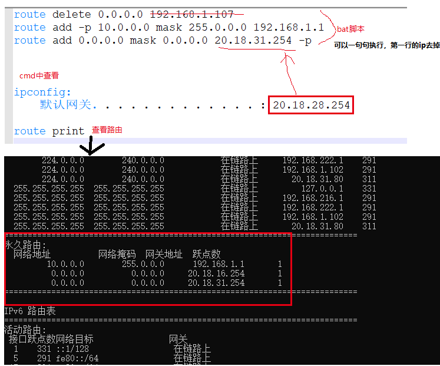

# 1. IE
## 1.1 执行文件地址
- window ie执行文件地址：C:\Program Files\internet explorer

# 2. 文件删除
## 2.1 移动硬盘上的目录删除
- 删除时提示，目录E:\ 不存在
- 处理
  建一个bat文件，加入下面内容
  ```
  DEL /F /A /Q \\?\%1
  RD /S /Q \\?\%1
  ```
- 参考地址：https://jingyan.baidu.com/article/a3aad71aafb0edb1fa009646.html

# 3. 双网卡使用

同时使用无线和有线：



# 4.window远程连接：

window + R

命令：mstsc