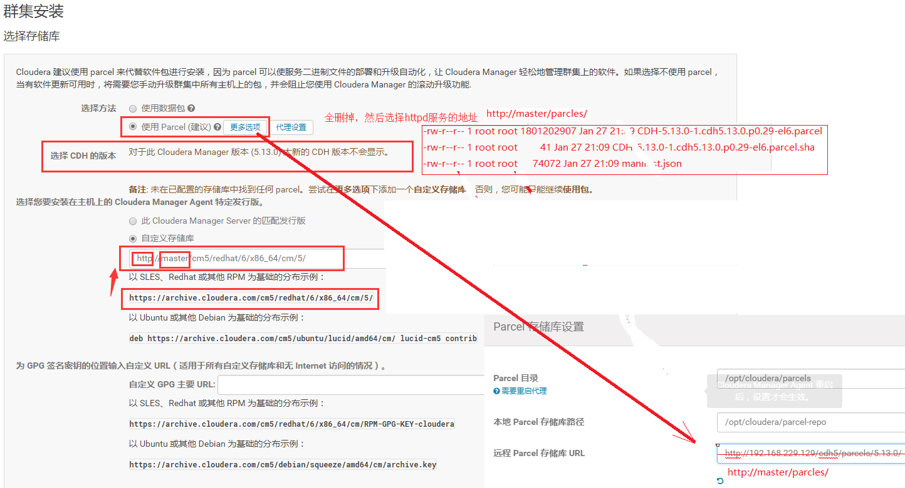
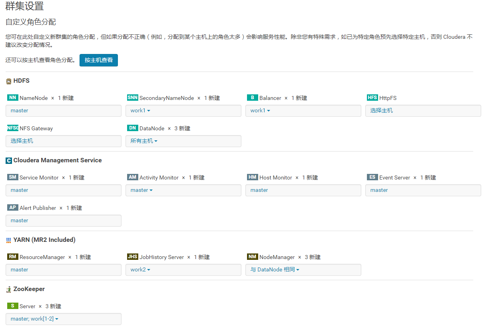

[CDH安装](#CDH安装)  
&emsp; [安装mysql](#安装mysql)  
&emsp; [环境准备](#环境准备)  
&emsp; [httpd部署](#httpd部署)


# CDH安装

## 安装mysql

## 环境准备
1. 关闭防火墙
> 命令：```service iptables stop```  
> 验证：```service iptables status```

2. 关闭防火墙自动运行：
> 命令: ```chkconfig iptables off```  
> 验证: ```chkconfig --list | grep iptables```

```
vi /etc/selinux/config
SELINUX=disabledf
```
> 清空防火墙策略：```iptables -F```

3. ip与hostname绑定  
```
127.0.0.1   localhost localhost.localdomain localhost4 localhost4.localdomain4
::1         localhost localhost.localdomain localhost6 localhost6.localdomain6

192.168.229.129 master
192.168.229.132 work1
192.168.229.133 work2
```

4. 检查python  
    cdh4.x系列 系统默认使用python2.6.6（2.7.5 hdfs ha时会出问题）  
    建议python2.6.6  
    cdh5.x系列可以使用python2.6. 或 python2.7.  

5. 安装jdk

6. 时钟同步

```
cat  /etc/sysconfig/clock
#重启生效
ZONE="Asia/Shanghai"
UTC=true

rm -rf /etc/localtime
ln -s /usr/share/zoneinfo/Asia/Shanghai /etc/localtime

cp /etc/ntp.conf /etc/ntp.conf.bak
cp /etc/sysconfig/ntpd /etc/sysconfig/ntpd.bak
echo "trict 192.168.229.129 mask 255.255.255.0 nomodify notrap" >> 
echo "SYNC_HWCLOCK=yes"

service ntpd restart

#work节点如上配置时区
ntpdate -u master

#crontab
29 * * * * /usr/sbin/ntpdate -u master
```
- ntp客户端配置：
```
crontab -e
29 * * * * /usr/sbin/ntpdate ntp1.cachecn.net ntp.api.bz 
29 * * * * /usr/sbin/ntpdate ntp1.cachecn.net ntp.api.bz >/dev/null 2>&1 ;/sbin/hwclock -w
```

## httpd部署
- 安装、配置
```
yum install -y httpd
chkconfig --list|grep httpd #查看是否开机自启
chkconfig httpd on #开机自启
cd /etc/httpd/conf.d #进入目录删除欢迎页面
mv welcome.conf welcome.conf.bak
mkdir /var/www/html/parcels #httpd文件目录
service httpd restart
```
- 判断是否成功:浏览器中访问http://192.168.229.129/


## 配置http服务作为CDH离线源

yum install -y yum-utils createrepo
cd /var/www/html/cm5/redhat/6/x86_64/cm/5
createrepo


不要安装cloudera-manager-server-db
先安装：
cloudera-manager-daemons
cloudera-manager-server


## 初始化mysql

```
create database cmf DEFAULT CHARACTER SET utf8;
grant all on cmf.* TO 'cmf'@'%' IDENTIFIED BY 'root';
flush privileges;
create database amon DEFAULT CHARACTER SET utf8;
grant all on amon.* TO 'amon'@'%' IDENTIFIED BY 'root';
flush privileges;
```


```
vim /etc/cloudera-scm-server/db.properties
com.cloudera.cmf.db.type=mysql
com.cloudera.cmf.db.host=192.168.229.129:3306
com.cloudera.cmf.db.name=cmf
com.cloudera.cmf.db.user=cmf
com.cloudera.cmf.db.password=root
com.cloudera.cmf.db.setupType=EXTERNAL
```


```
cd /var/log/cloudera-scm-server/
ll
service cloudera-scm-server start
service cloudera-scm-server status
```


异常：  
> [root@master java]# service cloudera-scm-server status       
> cloudera-scm-server dead but pid file exists

处理：
> rm -f /var/run/cloudera-scm-server.pid

异常：
> Caused by: java.lang.ClassNotFoundException: Could not load requested class : com.mysql.jdbc.Driver

处理：
> 加入mysql驱动  

```
mkdir -p /usr/share/java
```

上传：mysql-connector-java-5.1.45-bin.jar

```
mv /zz/soft/mysql-connector-java-5.1.45-bin.jar /usr/share/java/mysql-connector-java.jar
```


```
查看日志：vim /var/log/cloudera-scm-serve/cloudera-scm-server.log
2018-01-28 09:52:35,160 INFO WebServerImpl:org.mortbay.log: jetty-6.1.26.cloudera.4
2018-01-28 09:52:35,163 INFO WebServerImpl:org.mortbay.log: Started SelectChannelConnector@0.0.0.0:7180
2018-01-28 09:52:35,163 INFO WebServerImpl:com.cloudera.server.cmf.WebServerImpl: Started Jetty server.
页面访问：http://master:7180
admin/admin
```


```
mkdir -p /var/www/html/cdh5/parcels/5.13.0
#不改，cdh会认为一直在下载，是未完成的
mv /var/www/html/cdh5/parcels/5.13.0/CDH-5.13.0-1.cdh5.13.0.p0.29-el6.parcel.sha1 /var/www/html/cdh5/parcels/5.13.0/CDH-5.13.0-1.cdh5.13.0.p0.29-el6.parcel.sha
[root@master html]# ll /var/www/html/cdh5/parcels/5.13.0
total 1759072
-rw-r--r-- 1 root root 1801202907 Jan 27 21:09 CDH-5.13.0-1.cdh5.13.0.p0.29-el6.parcel
-rw-r--r-- 1 root root         41 Jan 27 21:09 CDH-5.13.0-1.cdh5.13.0.p0.29-el6.parcel.sha
-rw-r--r-- 1 root root      74072 Jan 27 21:09 manifest.json
```








```
mkdir /var/www/html/cm/repodata
下载这里的文件:
http://archive-primary.cloudera.com/cdh5/redhat/6/x86_64/cdh/5.13.0/repodata/
下载的文件上传到/var/www/html/cm/repodata
```


异常：
> [root@work1 app]# rpm -ivh cloudera-manager-agent-5.13.0-1.cm5130.p0.55.el6.x86_64.rpm 
> warning: cloudera-manager-agent-5.13.0-1.cm5130.p0.55.el6.x86_64.rpm: Header V4 DSA/SHA1 Signature, key ID e8f86acd: NOKEY
> error: Failed dependencies:
  ​      /lib/lsb/init-functions is needed by cloudera-manager-agent-5.13.0-1.cm5130.p0.55.el6.x86_64

处理：

```
yum -y install lsb
```


rpm -ivh cloudera-manager-daemons-5.13.0-1.cm5130.p0.55.el6.x86_64.rpm
rpm -ivh cloudera-manager-agent-5.13.0-1.cm5130.p0.55.el6.x86_64.rpm


问题：
> Cloudera 建议将 /proc/sys/vm/swappiness 设置为最大值 10。当前设置为 60。使用 sysctl 命令在运行时更改该设置并编辑 /etc/sysctl.conf，以在重启后保存该设置。您可以继续进行安装，但 Cloudera Manager 可能会报告您的主机由于交换而运行状况不良。以下主机将受到影响： 

解决：

```
echo 'vm.swappiness = 10' >> /etc/sysctl.conf
sysctl -p
```


问题：
> 已启用透明大页面压缩，可能会导致重大性能问题。请运行“echo never > /sys/kernel/mm/transparent_hugepage/defrag”和“echo never > /sys/kernel/mm/transparent_hugepage/enabled”以禁用此设置，然后将同一命令添加到 /etc/rc.local 等初始化脚本中，以便在系统重启时予以设置。以下主机将受到影响: 

解决：

```
echo never > /sys/kernel/mm/transparent_hugepage/defrag
echo never > /sys/kernel/mm/transparent_hugepage/enabled

echo 'echo never > /sys/kernel/mm/transparent_hugepage/defrag' >> /etc/rc.local
echo 'echo never > /sys/kernel/mm/transparent_hugepage/enabled' >> /etc/rc.local
```

使用指定的jdk参考地址：  
http://blog.csdn.net/Elonyong/article/details/78716341
http://blog.csdn.net/mamls/article/details/78268064


---------------------------------------------------------------------------


cdh
wget http://archive.cloudera.com/cdh5/parcels/5.13.0/CDH-5.13.0-1.cdh5.13.0.p0.29-el6.parcel
wget http://archive.cloudera.com/cdh5/parcels/5.13.0/CDH-5.13.0-1.cdh5.13.0.p0.29-el6.parcel.sha1
wget http://archive.cloudera.com/cdh5/parcels/5.13.0/manifest.json

cm
wget http://archive.cloudera.com/cm5/repo-as-tarball/5.13.0/cm5.13.0-centos6.tar.gz
wget http://archive.cloudera.com/cm5/repo-as-tarball/5.13.0/cm5.13.0-centos6.tar.gz.md5
wget http://archive.cloudera.com/cm5/repo-as-tarball/5.13.0/cm5.13.0-centos6.tar.gz.sha1

cloudera-manager.repo
wget https://archive.cloudera.com/cm5/redhat/6/x86_64/cm/cloudera-manager.repo

mkdir -p /var/www/html/parcels

去掉1， 不认一直认为是在下载
mv /zz/soft/CDH-5.13.0-1.cdh5.13.0.p0.29-el6.parcel.sha1 /zz/soft/CDH-5.13.0-1.cdh5.13.0.p0.29-el6.parcel.sha
mv /zz/soft/CDH-5.13.0-1.cdh5.13.0.p0.29-el6.parcel /zz/soft/CDH-5.13.0-1.cdh5.13.0.p0.29-el6.parcel.sha /zz/soft/manifest.json /var/www/html/parcels

tar -zxvf cm5.13.0-centos6.tar.gz -C /var/www/html
cd /var/www/html
mkdir -p cm5/redhat/6/x86_64/
mv cm cm5/redhat/6/x86_64/

mv cloudera-manager.repo /etc/yum.repos.d
vim /etc/yum.repos.d/cloudera-manager.repo
​	[cloudera-manager]
​	# Packages for Cloudera Manager, Version 5, on RedHat or CentOS 6 x86_64                  
​	name=Cloudera Manager
​	#基于httpd的本地yum源使用的是http
​	baseurl=http://master/cm5/redhat/6/x86_64/cm/5/
​	#gpgkey =https://archive.cloudera.com/cm5/redhat/6/x86_64/cm/RPM-GPG-KEY-cloudera    
​	gpgcheck = 0

yum clearn all
yum repolist
yum list | grep cloudera-manager

scp /etc/yum.repos.d/cloudera-manager.repo work1:/etc/yum.repos.d/
scp /etc/yum.repos.d/cloudera-manager.repo work2:/etc/yum.repos.d/

master机器
yum install cloudera-manager-daemons
yum install cloudera-manager-server

vim /etc/cloudera-scm-server/db.properties
com.cloudera.cmf.db.type=mysql
com.cloudera.cmf.db.host=master:3306
com.cloudera.cmf.db.name=cmf
com.cloudera.cmf.db.user=cmf
com.cloudera.cmf.db.password=root
com.cloudera.cmf.db.setupType=EXTERNAL


cd /var/log/cloudera-scm-server/
ll
service cloudera-scm-server status
service cloudera-scm-server start


问题：找不到java home
处理：yum install jdk
问题：service cloudera-scm-server start 启动直接faild，目录/var/log/cloudera-scm-server下只有.out日志(报找不到java_home)，没有其他日志
处理：yum install jdk
上面2个问题归结为一个问题，找不到java_home:
处理：
```
查看JAVA_HOME的路径，然后把自己装的jdk软连接到那
vim /usr/share/cmf/schema/scm_prepare_database.sh
mkdir /usr/java
ln -s /zz/app/jdk1.8.0_121/ /usr/java/jdk1.8
```


用yum 安装jdk后，安装cm在界面上指定主机时，找不到主机
报错：一直报超时
卸载yum 安装的jdk


时钟偏差问题：work节点启动ntpd：service ntpd restart


yum命令
http://blog.csdn.net/cheng830306/article/details/24780717


/usr/sbin/ntpdate 问题
28 Feb 12:45:49 ntpdate[42638]: the NTP socket is in use, exiting
处理
ps -ef|grep xntpd
lsof –i:123
```
[root@c3n-zj-nb1-183-131-54-182 kafka]# lsof -i:123
COMMAND  PID USER   FD   TYPE    DEVICE SIZE/OFF NODE NAME
ntpd    7276  ntp   16u  IPv4 533443168      0t0  UDP *:ntp 
ntpd    7276  ntp   17u  IPv6 533443169      0t0  UDP *:ntp 
ntpd    7276  ntp   18u  IPv4 533443175      0t0  UDP localhost:ntp 
ntpd    7276  ntp   19u  IPv4 533443176      0t0  UDP c3n-zj-nb1-183-131-54-182:ntp 
ntpd    7276  ntp   20u  IPv4 533443177      0t0  UDP 172.16.54.182:ntp 
ntpd    7276  ntp   21u  IPv4 533443178      0t0  UDP 101.71.76.54:ntp 
ntpd    7276  ntp   22u  IPv4 533443179      0t0  UDP 120.199.83.54:ntp 
ntpd    7276  ntp   23u  IPv6 533443180      0t0  UDP localhost6:ntp 
ntpd    7276  ntp   24u  IPv6 533443181      0t0  UDP [fe80::1a66:daff:fe71:1f8b]:ntp 
ntpd    7276  ntp   25u  IPv6 533443182      0t0  UDP [fe80::1a66:daff:fe71:1f8b]:ntp 
ntpd    7276  ntp   26u  IPv6 533443183      0t0  UDP [fe80::1a66:daff:fe71:1f8b]:ntp 
ntpd    7276  ntp   27u  IPv6 533443184      0t0  UDP [fe80::1a66:daff:fe71:1f8b]:ntp
```
kill -9 7276
重新同步
```
/usr/sbin/ntpdate 183.131.54.181
```


问题：ntpd dead but pid file exists
```
[root@c3n-zj-nb1-183-131-54-182 kafka]# service ntpdate status
[root@c3n-zj-nb1-183-131-54-182 kafka]# service ntpd status   
ntpd dead but pid file exists
[root@c3n-zj-nb1-183-131-54-182 kafka]# service ntpd restart
Shutting down ntpd:                                        [FAILED]
Starting ntpd:                                             [  OK  ]
[root@c3n-zj-nb1-183-131-54-182 kafka]# service ntpd status 
ntpd (pid  51661) is running...
```

问题：
提示某台机器时钟偏差爆红
处理：
同步时钟，同时配置ntpd的配置，一台同步外网的，其余的要与这台同步；这样cdh才认为所有机器的时间是同步的

启动agent 要用service 启动，不然有些服务会无法启动


/etc/cloudera-scm-agent/config.ini

什么配置