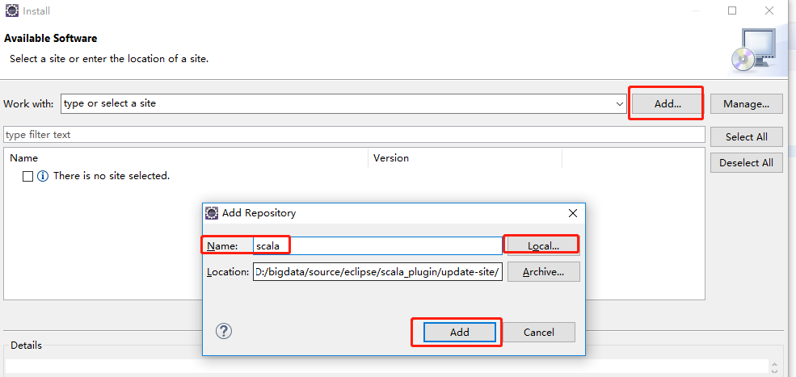
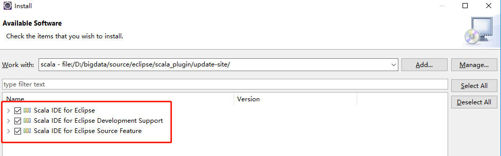

# 一、下载、安装

下载地址：https://www.eclipse.org/downloads/

历史版本：https://www.eclipse.org/downloads/packages/release

# 二、eclipse使用

## 1. maven配置

### 1.1 添加maven

-  window--》preference--》Maven--》Installations

  - Add--》Installation home（maven的地址）

  - User Settings

    修改maven的配置文件

## 2. scala插件

### 2.1 相关地址

参考地址：https://blog.csdn.net/yamaxifeng_132/article/details/78778748

官方插件下载地址：http://scala-ide.org/download/current.html

- 下载：*(If you cannot use the update site, a downloadable local update site is available:* [zipfile](http://download.scala-ide.org/sdk/lithium/e47/scala212/stable/update-site.zip)*)*

集成好的eclipse：http://scala-ide.org/download/sdk.html

### 2.2 离线安装scala插件

- 解压 `update-site` 文件

- 在Eclipse中选择Help->Install new Software

  - 目录为插件解压后的目录

  

## 3. 创建scala的maven项目

创建scala的maven项目：https://blog.csdn.net/mtj66/article/details/77570653

## 4. 快捷键

alt + shift + l：补全返回值

# 三、scala eclipse

## 1. 地址

http://scala-ide.org/download/sdk.html

## 2. 

