# 1. 下载

# 2. 破解

# 3. 配置

## 3.1 注释模版

### 3.1.1 参考地址：

[idea生成类注释和方法注释的正确方法](https://blog.csdn.net/qq_34581118/article/details/78409782)

### 3.1.2 类注解模版

- setting --> Editor -> File and Code Templates --> includes(File Header.java, 每个类都引用了它)
  ```
  /**
   * Description: </br>
   * author: 张政 </br>
   * date: ${YEAR}-${MONTH}-${DAY} </br>
   */
  ```

- 或者
  setting --> Editor -> File and Code Templates -> Files -> Class (修改)

  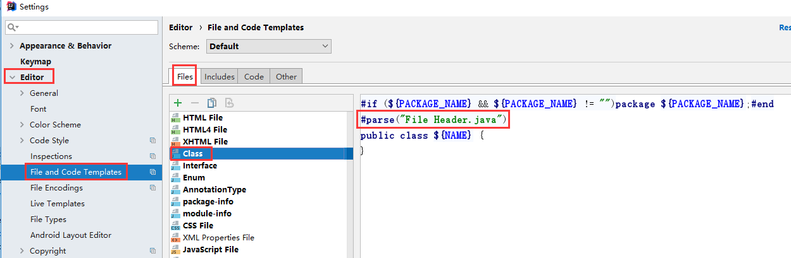
  
  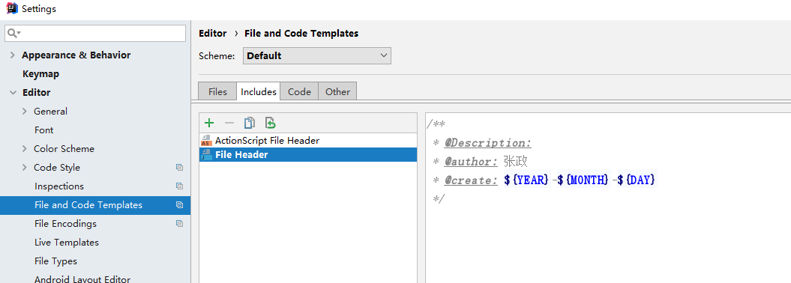

### 3.1.3 方法注解模版

- setting --> Editor -> Live Templates -> 点击右边加号为自己添加一个Templates Group -> 然后选中自己的Group再次点击加号添加Live Templates
  ```
  ** 
   * Description: $description$ </br>
   * author: 张政 </br>
   * date: $date$ </br>
  $param$ 
   * @return $return$ 
   */ 
  ```

  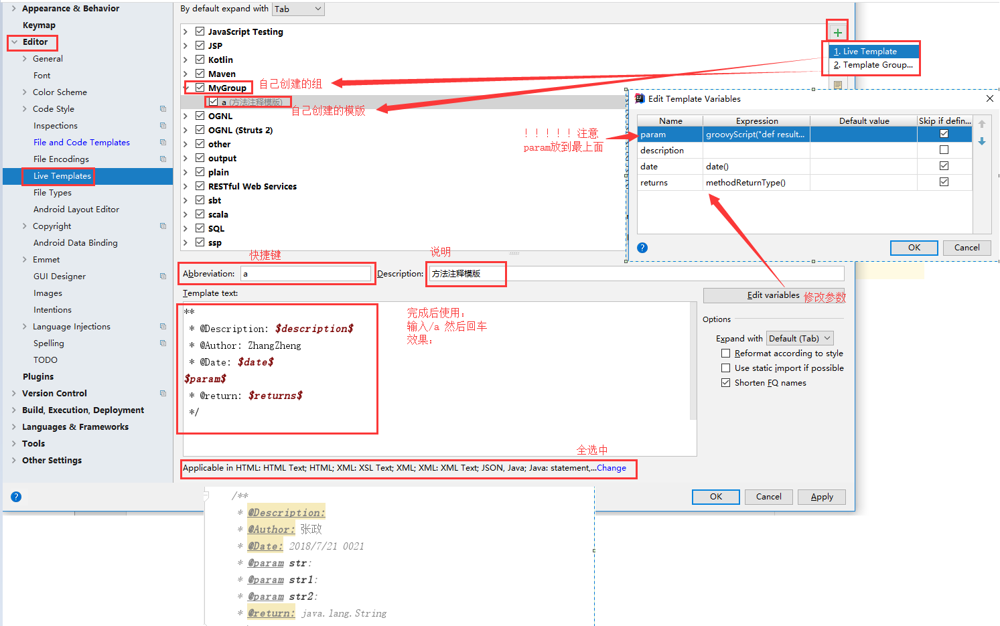

- 问题

  有Exception时，注释里没有

### 3.1.4 groovyScript脚本

- 修改注解中的param为多个（自带的methodParams是数组，参数会放到一行）
- [参考地址](https://zhuanlan.zhihu.com/p/32891910)

- param为空的时候显示 `@param`
  ```
  groovyScript("def result=''; def params=\"${_1}\".replaceAll('[\\\\[|\\\\]|\\\\s]', '').split(',').toList(); for(i = 0; i < params.size(); i++) {result+=' * @param ' + params[i] + ':\\t' + ((i < params.size() - 1) ? '\\n' : '')}; return result", methodParameters())
  ```
  ```
  ** 
   * Description: $description$ </br></br>
   * author: 张政 </br></br>
   * date: $date$ </br></br>
  $param$ 
   * @return $return$ 
   */ 
  ```

- param为空的时候不显示 `@param`
  ```
  groovyScript("def result=''; def params=\"${_1}\".replaceAll('[\\\\[|\\\\]|\\\\s]', '').split(',').toList(); if(params[0] == ''){result='\\n';for(i = 0; i < params.size(); i++) {result+=' * @param ' + params[i] + ': ' + ((i < params.size() - 1) ? '\\n' : '')}}; return result", methodParameters())
  ```
  ```
  ** 
   * Description: $description$ </br></br>
   * author: 张政 </br></br>
   * date: $date$ </br></br>$param$ 
   * @return $return$ 
   */ 
  ```

## 3.2 jdk配置

### 3.2.1 快捷键
进入settings 默认快捷键：ctrl + alt + s

进入project structure默认快捷键：ctrl + alt + shift + s

### 3.2.2 idea添加jdk依赖

idea中点击File --> project structure（快捷键：ctrl + alt + shift + s）--> SDKS --> 点击 ’+’ --> 选择jdk --> 选择jdk的路径然后确定

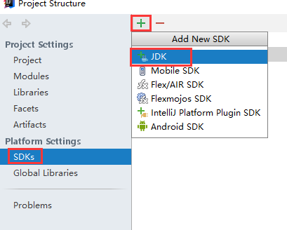

 

### 3.2.3 修改maven运行依赖jdk

在idea中点击 File --> settings（快捷键：ctrl + alt + s） --> 搜索输入“maven”找到Runner --> 把JRE选项切换到需要的jdk版本

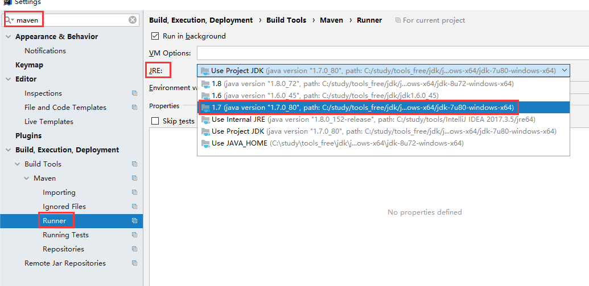

### 3.2.4 修改项目依赖、编译使用jdk版本

- File----》Setting ----》Compiler ----》Java Compiler----》切换jdk（Target bytecode version）

  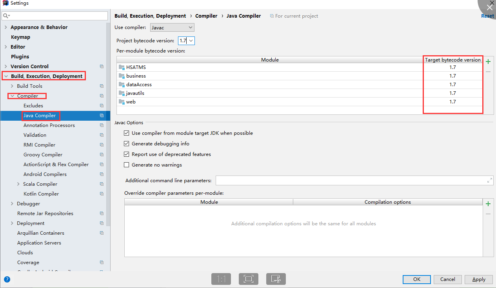

- File----》Setting ----》Compiler ----》Java Compiler----》切换jdk（Target bytecode version）

  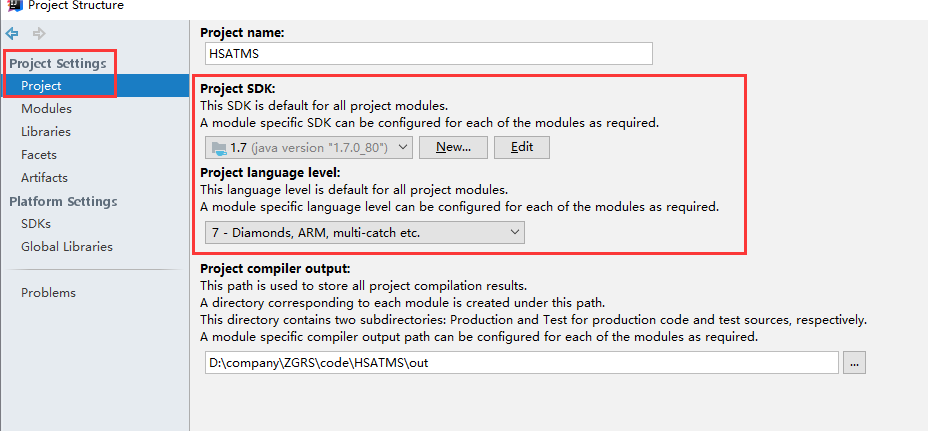

- Idea----》project structure----》modules----》点击要更换jdk的modules----》切换sources下的 language level----》同时切换Dependencies下的module  sdk

  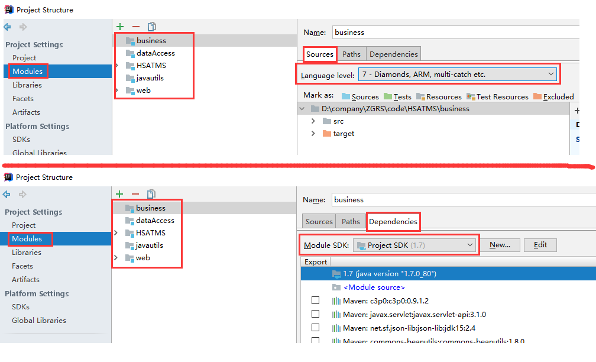

## 3.3 maven配置

> 项目中已经自带maven包，存在了项目文件夹HSATMS下的developEnv/maven/路径下。
>
> Idea中maven的配置包括三项设定：Maven home directory，User settings file， Local repository。 
>
> 这三项设定有两种配置方法。
>
> 第一种方法是通过Settings界面设定，此方法只能设置绝对路径。
>
> 第二种方法是通过Workspace.xml文件设定，此方法可以设置相对路径，项目中已经通过相对路径将这三项设定指向了自带maven包中对应路径。当打开Idea时，Idea将读取Workspace.xml中的配置信息，并反映在Settings界面里。所以，通常情况下，开发人员无需在自己配置maven

### 3.3.1 通过Settings界面配置
- 可通过File->Settings, 搜索Maven，得到如下界面，加以配置
  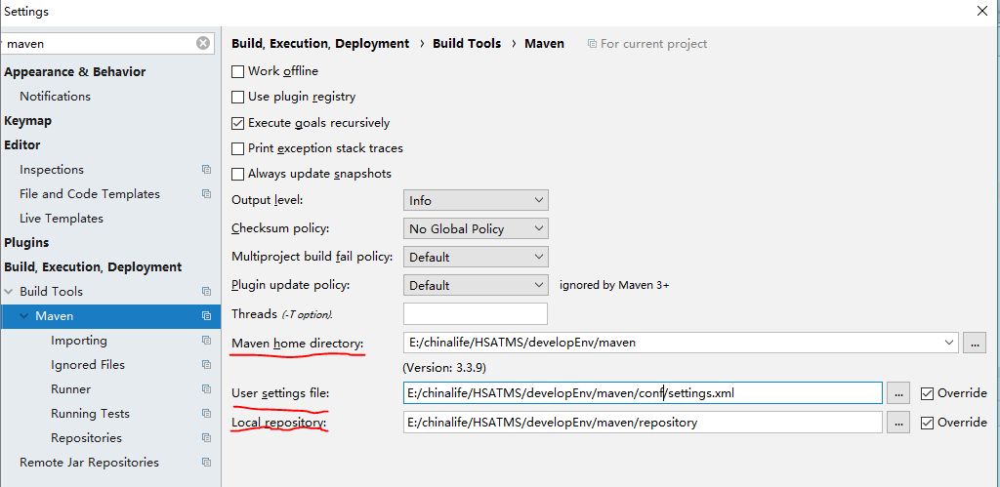

### 3.3.2 在Workspace.xml文件中配置
  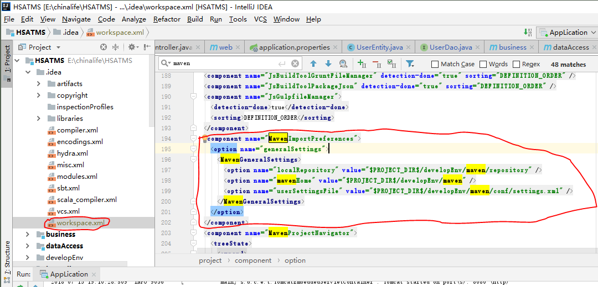


# 4. 使用教程

## 4.1 参考地址
- [w3cchool 教程](https://www.w3cschool.cn/intellij_idea_doc/intellij_idea_doc-l9vd2ea8.html)

## 4.2 文件模版变量

- [IntelliJ IDEA文件模板变量](https://www.w3cschool.cn/intellij_idea_doc/intellij_idea_doc-l9vd2ea8.html)

- IntelliJ IDEA文件模板变量

  一个 IntelliJ IDEA 文件模板中包含了文件模板变量，当您应用文件模板时，文件模板变量将被替换为它们的值。

  文件模板变量是以美元符号开始的字符串，后跟变量名称。变量名称可以用大括号括起来。例如： $MyVariable 或 ${MyVariable}。

  ## IntelliJ IDEA 预定义的文件模板变量

  IntelliJ IDEA 附带了一组预定义的模板变量。

  可用的预定义文件模板变量是：

  - ${PACKAGE_NAME} - 将在其中创建新类或接口的目标包的名称。
  - ${PROJECT_NAME} - 当前项目的名称。
  - ${FILE_NAME} - 将要创建的 PHP 文件的名称。
  - ${NAME} - 您在创建文件的过程中，在 "新建文件" 对话框中指定的新文件的名称。
  - ${USER} - 当前用户的登录名。
  - ${DATE} - 当前系统日期。
  - ${TIME} - 当前系统时间。
  - ${YEAR} - 本年度。
  - ${MONTH} - 本月。
  - ${DAY} - 当月的当前日期。
  - ${HOUR} - 当前时间
  - ${MINUTE} - 当前分钟。
  - ${PRODUCT_NAME} - 将在其中创建文件的 IDE 的名称。
  - ${MONTH_NAME_SHORT} - 月份名称的前3个字母。示例：1月，2月等。
  - ${MONTH_NAME_FULL} - 一个月的全名。示例：1月，2月等

  IntelliJ IDEA 为 PHP 包括模板提供了一组附加变量，即可被包含在其他 PHP 文件模板中的可重用片段的模板。内置的 PHP 包含模板用于生成文件头和 PHPDoc 文档注释。以下变量在 PHP 包含模板中可用：

  - ${NAME} - 将为其生成 PHPDoc 注释的类，字段或函数（方法）的名称。
  - ${NAMESPACE} - 类或字段命名空间的完全限定名（无斜杠）。
  - ${CLASS_NAME} - 定义了生成 PHPDoc 注释的字段的类的名称。
  - ${STATIC}- 如果要为其生成注释的函数 (方法) 或字段为静态（static），则获取静态值。否则计算结果为空字符串。
  - ${TYPE_HINT}- 提示函数 (方法) 的返回值以生成注释。如果无法通过函数 (方法) 的静态分析检测到返回类型，则计算结果为 void。
  - ${PARAM_DOC} - - 参数的文档注释。计算为一组 @param 类型名称的行。如果要为其生成注释的函数不包含任何参数，则该变量将计算为空内容。
  - ${THROWS_DOC} - 异常的文档注释。计算结果为一组 @throws 类型的行。如果要为其生成注释的函数不抛出任何异常，则该变量将计算为空内容。
  - ${DS}- 一个美元字符（$）。该变量计算为一个简单的美元字符（$），该变量的计算结果为纯美元字符 ($)，当您需要转义此符号时使用它，使其不被视为变量的前缀。
  - ${CARET} - 指出了在生成和添加评论后插入符号的位置。${CARET}只有在文件创建期间生成和插入 PHPDoc 注释时才应用。当 PHPDoc 注释是通过代码| 生成| PHPDoc 块（Code | Generate | PHPDoc block）创建的，可以使用多个函数或方法的选择，因此文档注释可以创建到几个类、函数、方法或字段。因此，IntelliJ IDEA 无法“选择”块来应用 ${CARET} 变量，因此在这种情况下，该 ${CARET} 变量将被忽略。

  ## IntelliJ IDEA 自定义文件模板变量

  IntelliJ IDEA 中除了预定义的文件模板变量之外，还可以指定自定义变量。如有必要，您可以使用 #setVTL 指令在模板中定义自定义变量的值 。

  例如，如果要使用您的全名，而不是通过预定义的变量 $ {USER} 定义的登录名，请编写以下结构：

  ```
  #set( $MyName = "John Smith" )
  ```

  如果在模板中未定义变量的值，IntelliJ IDEA 将要求您在应用模板时指定变量。

  您可以防止将模板变量中的美元字符 ($) 作为前缀处理。如果您需要一个美元字符（插入值为 $），请改用 ${DS} 文件模板变量。当应用模板时，此变量的计算结果为纯美元字符 ($)。

  ## IntelliJ IDEA 的 #parse 指令

  使用 #parse 指令，您可以在文件模板中包括其他模板。这对于将可重用内容（例如标准头，版权声明等）插入到多个文件模板中很有用。

  该 #parse 指令的语法 是：

  ```
  #parse("<template_name.extension>")
  ```

  例如： #parse("File Header.java")。

  在其他模板中可以像这样引用的模板显示在 "文件和代码模板设置" 页的 "包含" 选项卡上。

## 4.3 javadoc
### 4.3.1 部分描述勿加`@`
- 注释时这些变量不要加`@`（eg：`@Description`）, 这些doc不识别， 可以像下面一样
  ```
   * Description: $description$ </br>
   * Author: 张政 </br>
   * Create: $date$ </br>
  ```

- 要生成doc的注解，且doc注解识别的变量（eg：@return）不要在变量后直接加`:`

  - eg：`@return:`  doc识别不了（加个空格，在加 `:`也会有问题 ，doc里会多个 `:`）

- 换行可以用`</br>`

### 4.3.2 idea生成doc
- Tools --》 Generate JavaDoc.. 

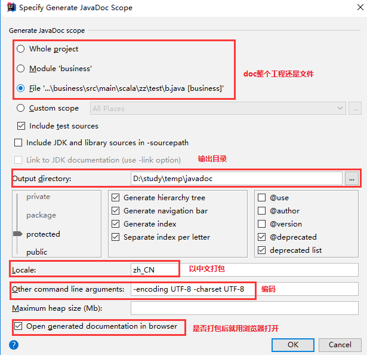

### 4.3.3 javadoc 标记 
- javadoc 标记由“@”及其后所跟的标记类型和专用注释引用组成 
- javadoc 标记有如下一些： 
> @author 标明开发该类模块的作者 
> @version 标明该类模块的版本 
> @see 参考转向，也就是相关主题 
> @param 对方法中某参数的说明 
> @return 对方法返回值的说明 
> @exception 对方法可能抛出的异常进行说明 

> @author 作者名 
> @version 版本号 
- 其中，@author 可以多次使用，以指明多个作者，生成的文档中每个作者之间使用逗号 (,) 隔开。@version 也可以使用多次，只有第一次有效 

- 使用 @param、@return 和 @exception 说明方法  
这三个标记都是只用于方法的。@param 描述方法的参数，@return 描述方法的返回值，@exception 描述方法可能抛出的异常。它们的句法如下： 
> @param 参数名 参数说明 
> @return 返回值说明 
> @exception 异常类名 说明 