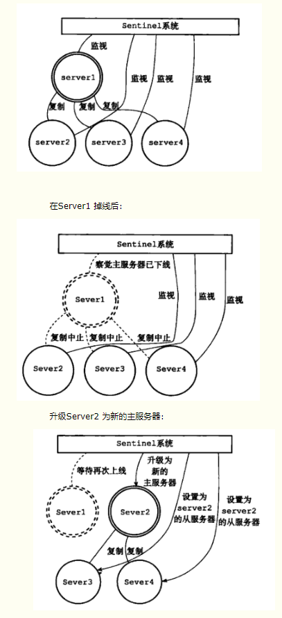

# 一、下载安装

## 1. 地址：

- 官网

  [Redis](http://www.baidu.com/link?url=1gN9bD6pMxcIWj9mM6Nj4ixDYx0r5gX-I8jxR1XOa0a)

- 中文官网

  [redis中文网](https://www.baidu.com/link?url=ZFW4o2FBUhSg-Y_EXTNKEBuRxW-8d73o4ycFnZYeMY3&wd=&eqid=c6fcdfda00023053000000035c360b84)


- linux版本下载地址

  - 最新稳定版本

    https://redis.io/download

  - 历史版本
  
    http://download.redis.io/releases/

- window版本下载：

  - https://github.com/MicrosoftArchive/redis/releases

## 2. 安装

1. 下载

2. 解压

   ```
   tar -zxvf redis-3.2.12.tar.gz
   ```

3. 编译

   ```
   cd redis-3.2.12
   make
   ```

4. 安装

   ```
   cd src
   make PREFIX=/usr/local/redis install
   ```

## 2. 启动

### 2.1 单实例启动
- 复制并修改配置文件，启动

  ```
  mkdir /zz/app/redis
  cp /zz/app/redis-3.2.12/redis.conf /zz/app/redis
  ```

- 修改配置文件 `vim redis.conf`

  ```
  daemonize yes
  ```

- 启动

  ```
  cd /zz/app/redis
  /usr/local/redis/bin/redis-server ./redis.conf
  ```

  

参考：[赵强老师：微课系列：（13）使用Redis客户端](https://ke.qq.com/course/307415)

redis客户端工具：

- Redis Desktop Manager
- Redis Client
- Redis Studio

参考：[Redis企业集群高级应用精品教程【图灵学院】](https://ke.qq.com/course/235432)

Nosql

- redis 
  key value内容缓存、高访问
- hbase
  分布式文件系统、链条形式
- mongodb
  （文档）web应用
- neo4j
   （图形）社交网络、推荐系统等

NoSQL数据库的四大分类：

- kv键值
- 文档型数据库
- 列存储数据库
- 图关系数据库


# 尚硅谷redis

http://www.atguigu.com/download.shtml#redis


# redis 命令
```
config get dir
config get requirepss
```

# redis持久化

## aof文件修复

先加载的是aof文件，aof文件损坏后，redis是起不来的，使用redis-check-aof 修复 `redis-check-aof --fix XXX.aof`

# 知识点

事务


好文地址：

https://blog.csdn.net/qq_34337272/article/details/80012284

https://juejin.im/post/5ad54d76f265da23970759d3


Redis3集群的安装、配置、高可用：https://blog.csdn.net/qq_27384769/article/details/80662597


# 异常

window中无法连接vmware中的redis：修改 `# bind 127.0.0.1` 为 `bind master`


# 二、redis集群

## 1. 哨兵模式（sentinel）




## 2. 官方redis cluster


## 3. Twemproxy


## 4. Codis


# 三、 资源地址

Redis详解之-集群方案：高性能（Codis3.2+Redis Cluster）（五）
https://blog.csdn.net/u010963948/article/details/78967628

Redis 3.2.1集群搭建
https://www.cnblogs.com/yuanermen/p/5717885.html

Redis详解之-集群方案：高性能（使用原生Redis Cluster）（四）
https://blog.csdn.net/u010963948/article/details/78963572

github: twitter/twemproxy
https://github.com/twitter/twemproxy

Redis cluster集群：原理及搭建
https://blog.csdn.net/truelove12358/article/details/79612954

Redis哨兵模式
https://www.cnblogs.com/kerwinC/p/6069864.html

Sentinel 哨兵
https://www.cnblogs.com/jaycekon/p/6237562.html

Codis 3.2 部署配置
https://studygolang.com/articles/10999?fr=sidebar

Codis3.2安装及使用指南
https://blog.csdn.net/Dr_Franks/article/details/83821320

缓存系列之五：通过codis3.2实现redis3.2.8集群的管理
https://www.cnblogs.com/reblue520/p/6874925.html

github: CodisLabs/codis
https://github.com/CodisLabs/codis

codis命令的支持：codis/doc/unsupported_cmds.md
https://github.com/CodisLabs/codis/blob/release3.2/doc/unsupported_cmds.md

github: codis: redis 修改部分
https://github.com/CodisLabs/codis/blob/release3.2/doc/redis_change_zh.md

jedis如何连接twemproxy
https://segmentfault.com/q/1010000008755852

简述redis的sentinel和Twemproxy
https://blog.csdn.net/Q176782/article/details/54945805

Redis 代理服务Twemproxy
https://blog.csdn.net/hguisu/article/details/9174459

Twemproxy 介绍与使用
https://blog.csdn.net/ronmy/article/details/66975789


# 四、安装时的一些笔记

```
####################################################################################
# redis 哨兵模式
pid
port
dbfilename
slaveof
slave-read-only
appendonly

vim redis-ms.sh
cd /zz/app/redis-1
/usr/local/redis/bin/redis-server ./redis.conf
cd /zz/app/redis-2
/usr/local/redis/bin/redis-server ./redis.conf
cd /zz/app/redis-3
/usr/local/redis/bin/redis-server ./redis.conf


①vim sentiel.conf
     将dir改为 /usr/local/redis/etc/ --就像redis.conf文件一样，我们统一放到这个文件下
②增加一行 sentinel monitor mymaster 192.168.123.11 6379 1
      上面红色字体分别是名称（随意）、主服务器IP、主服务器端口、投票选举次数
③sentinel down-after-milliseconds mymaster 5000
    mymaster和上面的名称对应上，默认是1s检测一次，现在是配置超时5000毫秒（5秒）
④sentinel parallel-syncs mymaster 2 #主服务器有两台从服务器


# 启动哨兵模式
/usr/local/redis/bin/redis-server ./sentinel.conf --sentinel --protected-mode no


# 远程无法连接问题
protected-mode no
https://blog.csdn.net/qq_41507845/article/details/80967282
启动 Sentinel 请使用“--protected-mode no”选项重新启动它
####################################################################################
# redis clust
cd /zz/app/redis1
/usr/local/redis/bin/redis-server /zz/app/redis1/redis.conf
cd /zz/app/redis2
/usr/local/redis/bin/redis-server /zz/app/redis2/redis.conf
cd /zz/app/redis3
/usr/local/redis/bin/redis-server /zz/app/redis3/redis.conf
cd /zz/app/redis4
/usr/local/redis/bin/redis-server /zz/app/redis4/redis.conf
cd /zz/app/redis5
/usr/local/redis/bin/redis-server /zz/app/redis5/redis.conf
cd /zz/app/redis6
/usr/local/redis/bin/redis-server /zz/app/redis6/redis.conf

# /zz/app/redis-3.2.12/src/redis-trib.rb create --replicas 1 master:6379 master:6380 work1:6379 work1:6380 work2:6379 work2:6380
# /zz/app/redis-3.2.12/src/redis-trib.rb create --replicas 1 master:6379 master:6380 master:6381 master:6382 master:6383 master:6384
/zz/app/redis-3.2.12/src/redis-trib.rb create --replicas 1 192.168.154.139:6379 192.168.154.139:6380 192.168.154.139:6381 192.168.154.139:6382 192.168.154.139:6383 192.168.154.139:6384


# 执行成功
[root@master app]# /zz/app/redis-3.2.12/src/redis-trib.rb create --replicas 1 192.168.154.136:6379 192.168.154.136:6380 192.168.154.136:6381 192.168.154.136:6382 192.168.154.136:6383 192.168.154.136:6384
>>> Creating cluster
>>> Performing hash slots allocation on 6 nodes...
Using 3 masters:
192.168.154.136:6379
192.168.154.136:6380
192.168.154.136:6381
Adding replica 192.168.154.136:6382 to 192.168.154.136:6379
Adding replica 192.168.154.136:6383 to 192.168.154.136:6380
Adding replica 192.168.154.136:6384 to 192.168.154.136:6381
M: d80c20aad025fae6a9a23463f20146f8bb9f38e8 192.168.154.136:6379
   slots:0-5460 (5461 slots) master
M: a2befecefc0d127983ebd9bcbd1cc8b4c500b992 192.168.154.136:6380
   slots:5461-10922 (5462 slots) master
M: 311960e7c2ade0333a716b2181224c51a5679951 192.168.154.136:6381
   slots:10923-16383 (5461 slots) master
S: 0dc59cc853f152b5f9c09ba1b44f5e2a00e2bb93 192.168.154.136:6382
   replicates d80c20aad025fae6a9a23463f20146f8bb9f38e8
S: 08821aa27a21a8b381bab197f848e0ad66c59e5b 192.168.154.136:6383
   replicates a2befecefc0d127983ebd9bcbd1cc8b4c500b992
S: 83297c5533780c4228a2dce79d00588c0a5c9808 192.168.154.136:6384
   replicates 311960e7c2ade0333a716b2181224c51a5679951
Can I set the above configuration? (type 'yes' to accept): yes
>>> Nodes configuration updated
>>> Assign a different config epoch to each node
>>> Sending CLUSTER MEET messages to join the cluster
Waiting for the cluster to join......
>>> Performing Cluster Check (using node 192.168.154.136:6379)
M: d80c20aad025fae6a9a23463f20146f8bb9f38e8 192.168.154.136:6379
   slots:0-5460 (5461 slots) master
   1 additional replica(s)
S: 83297c5533780c4228a2dce79d00588c0a5c9808 192.168.154.136:6384
   slots: (0 slots) slave
   replicates 311960e7c2ade0333a716b2181224c51a5679951
S: 08821aa27a21a8b381bab197f848e0ad66c59e5b 192.168.154.136:6383
   slots: (0 slots) slave
   replicates a2befecefc0d127983ebd9bcbd1cc8b4c500b992
M: a2befecefc0d127983ebd9bcbd1cc8b4c500b992 192.168.154.136:6380
   slots:5461-10922 (5462 slots) master
   1 additional replica(s)
M: 311960e7c2ade0333a716b2181224c51a5679951 192.168.154.136:6381
   slots:10923-16383 (5461 slots) master
   1 additional replica(s)
S: 0dc59cc853f152b5f9c09ba1b44f5e2a00e2bb93 192.168.154.136:6382
   slots: (0 slots) slave
   replicates d80c20aad025fae6a9a23463f20146f8bb9f38e8
[OK] All nodes agree about slots configuration.
>>> Check for open slots...
>>> Check slots coverage...
[OK] All 16384 slots covered.


yum install ruby
yum install -y rubygems
gem install redis

# 异常
[root@master app]# gem install redis
ERROR:  Error installing redis:
        redis requires Ruby version >= 2.2.2.

离线ruby
https://blog.csdn.net/liuduohello1/article/details/78711734


############################
#异常
[root@master rubygems-3.0.2]# curl -L get.rvm.io | bash -s stable 
  % Total    % Received % Xferd  Average Speed   Time    Time     Time  Current
                                 Dload  Upload   Total   Spent    Left  Speed
100 24173  100 24173    0     0   2445      0  0:00:09  0:00:09 --:--:-- 10835
Downloading https://github.com/rvm/rvm/archive/.tar.gz
curl: (35) SSL connect error

Could not download 'https://github.com/rvm/rvm/archive/.tar.gz'.
  curl returned status '35'.

Downloading https://bitbucket.org/mpapis/rvm/get/.tar.gz
curl: (35) SSL connect error

Could not download 'https://bitbucket.org/mpapis/rvm/get/.tar.gz'.
  curl returned status '35'.

# 处理
https://blog.csdn.net/lixwjava/article/details/50408070
yum -y update nss

############################
#异常
redis requires Ruby version >= 2.2.2问题
https://www.cnblogs.com/carryping/p/7447823.html

############################
#异常
[root@master app]# /zz/app/redis-3.2.12/src/redis-trib.rb create --replicas 1 master:6379 master:6380 master:6381 master:6382 master:6383 master:6384 master:6385
>>> Creating cluster
[ERR] Node master:6379 is not configured as a cluster node.

https://blog.csdn.net/qq_33176609/article/details/79251836


############################
#异常
Adding replica master:6382 to master:6379
Adding replica master:6383 to master:6380
Adding replica master:6384 to master:6381
M: c1a59c0c4ba78b4196b26ef17c6cf65048b891c3 master:6379
   slots:0-5460 (5461 slots) master
M: b2c0d15c2861c065528c588306f93e64b89e25a1 master:6380
   slots:5461-10922 (5462 slots) master
M: f12b5f7a6a82be7fb0e13aa30323673bd896f6ef master:6381
   slots:10923-16383 (5461 slots) master
S: 07300d3f86c4ed3dc71e7d3a5336b14e827a6a90 master:6382
   replicates c1a59c0c4ba78b4196b26ef17c6cf65048b891c3
S: e33346d6f09de136f05fcfb10f61c48c56ddbd62 master:6383
   replicates b2c0d15c2861c065528c588306f93e64b89e25a1
S: c816f8c8406a5ce5dfb56026f55759aac69bb99a master:6384
   replicates f12b5f7a6a82be7fb0e13aa30323673bd896f6ef
Can I set the above configuration? (type 'yes' to accept): yes
>>> Nodes configuration updated
>>> Assign a different config epoch to each node
>>> Sending CLUSTER MEET messages to join the cluster
/usr/local/rvm/gems/ruby-2.3.3/gems/redis-4.1.0/lib/redis/client.rb:124:in `call': ERR Invalid node address specified: master:6379 (Redis::CommandError)
        from /usr/local/rvm/gems/ruby-2.3.3/gems/redis-4.1.0/lib/redis.rb:3282:in `block in cluster'
        from /usr/local/rvm/gems/ruby-2.3.3/gems/redis-4.1.0/lib/redis.rb:50:in `block in synchronize'
        from /usr/local/rvm/rubies/ruby-2.3.3/lib/ruby/2.3.0/monitor.rb:214:in `mon_synchronize'
        from /usr/local/rvm/gems/ruby-2.3.3/gems/redis-4.1.0/lib/redis.rb:50:in `synchronize'
        from /usr/local/rvm/gems/ruby-2.3.3/gems/redis-4.1.0/lib/redis.rb:3281:in `cluster'
        from /zz/app/redis-3.2.12/src/redis-trib.rb:811:in `block in join_cluster'
        from /zz/app/redis-3.2.12/src/redis-trib.rb:809:in `each'
        from /zz/app/redis-3.2.12/src/redis-trib.rb:809:in `join_cluster'
        from /zz/app/redis-3.2.12/src/redis-trib.rb:1301:in `create_cluster_cmd'
        from /zz/app/redis-3.2.12/src/redis-trib.rb:1701:in `<main>'

参考地址：https://blog.csdn.net/qq_37481017/article/details/85759429


############################
#异常
Adding replica master:6382 to 192.168.154.136:6379
Adding replica master:6383 to master:6381
Adding replica master:6384 to 192.168.154.136:6380
M: c1a59c0c4ba78b4196b26ef17c6cf65048b891c3 192.168.154.136:6379
   slots:0-5460 (5461 slots) master
M: b2c0d15c2861c065528c588306f93e64b89e25a1 192.168.154.136:6380
   slots:5461-16383 (10923 slots) master
M: f12b5f7a6a82be7fb0e13aa30323673bd896f6ef master:6381
   slots:5461-16383 (10923 slots) master
S: 07300d3f86c4ed3dc71e7d3a5336b14e827a6a90 master:6382
   replicates c1a59c0c4ba78b4196b26ef17c6cf65048b891c3
S: e33346d6f09de136f05fcfb10f61c48c56ddbd62 master:6383
   replicates f12b5f7a6a82be7fb0e13aa30323673bd896f6ef
S: c816f8c8406a5ce5dfb56026f55759aac69bb99a master:6384
   replicates b2c0d15c2861c065528c588306f93e64b89e25a1
Can I set the above configuration? (type 'yes' to accept): yes
/usr/local/rvm/gems/ruby-2.3.3/gems/redis-4.1.0/lib/redis/client.rb:124:in `call': ERR Slot 0 is already busy (Redis::CommandError)
        from /usr/local/rvm/gems/ruby-2.3.3/gems/redis-4.1.0/lib/redis.rb:3282:in `block in cluster'
        from /usr/local/rvm/gems/ruby-2.3.3/gems/redis-4.1.0/lib/redis.rb:50:in `block in synchronize'
        from /usr/local/rvm/rubies/ruby-2.3.3/lib/ruby/2.3.0/monitor.rb:214:in `mon_synchronize'
        from /usr/local/rvm/gems/ruby-2.3.3/gems/redis-4.1.0/lib/redis.rb:50:in `synchronize'
        from /usr/local/rvm/gems/ruby-2.3.3/gems/redis-4.1.0/lib/redis.rb:3281:in `cluster'
        from /zz/app/redis-3.2.12/src/redis-trib.rb:212:in `flush_node_config'
        from /zz/app/redis-3.2.12/src/redis-trib.rb:776:in `block in flush_nodes_config'
        from /zz/app/redis-3.2.12/src/redis-trib.rb:775:in `each'
        from /zz/app/redis-3.2.12/src/redis-trib.rb:775:in `flush_nodes_config'
        from /zz/app/redis-3.2.12/src/redis-trib.rb:1296:in `create_cluster_cmd'
        from /zz/app/redis-3.2.12/src/redis-trib.rb:1701:in `<main>'

参考：https://www.cnblogs.com/xieyupeng/p/9365775.html
cluster-config-file 不能相同


############################
#异常
(error) MOVED 原因和解决方案
https://blog.csdn.net/liu0808/article/details/80098568


############################################################################################################################################################
codis github
	https://github.com/CodisLabs/codis
Codis3.2安装及使用指南
	https://blog.csdn.net/Dr_Franks/article/details/83821320
Codis 3.2 部署配置
	https://studygolang.com/articles/10999?fr=sidebar

go：
	http://www.runoob.com/go/go-environment.html

Codis3.2安装及使用指南
	https://blog.csdn.net/Dr_Franks/article/details/83821320


############################
#异常
libc.so.6: version GLIBC_2.14 not found”报错问题
https://blog.csdn.net/heylun/article/details/78833050
http://ftp.gnu.org/gnu/glibc/
wget -P /zz/app http://ftp.gnu.org/gnu/glibc/glibc-2.17.tar.gz 
wget -P /zz/app http://ftp.gnu.org/gnu/glibc/glibc-ports-2.16.0.tar.gz
```

