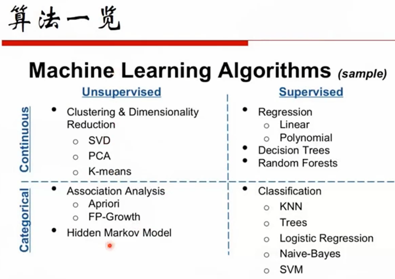

# 1. 深度学习视频教程

视频地址：

## 1.1 第01课_机器学习中的必修数学

### 1.1.1 机器学习分类

- 分类预测：

  要判断你这个人是好是坏、判断你这个产品是合格不合格，需要得到的最终的指标是还是不是，是abcd中的某一类或是某几类，是离散的目标

- 回归分析：

  比如说你要预测房价，房价他是一个连续的值，比如说从几万到几十万都有

------

### 1.1.2 监督学习

- 基于对人的调查，根据身高、发长、抽烟 来 判断性别
- 已有一批数据：知道身高、发长、抽烟、性别，基于已知目标（标签）的这些数据（训练集）生成算法，然后再基于这个算法再去预测未知性别的，但已知身高、发长、抽烟的数据  这个任务叫有监督学习
- 有监督学习目标：
  - 任务是：基于特征判断目标

  - 手段是：基于这些有特征、有目标的数据，去训练出一个算法；对另外一些没有目标，但是有特征的数据去得到它的目标
- 上图中目标是男是女是离散的，所以这是分类问题

------

- 测试集：只有特征，没有目标

------

### 1.1.3 无监督学习

无监督学习：已知数据是连目标都不知道的，例如上面：知道数据的风格，你也不知道他的风格（测试的时候就不知道）

------

已经知道这些点的分布，基于这些点的分布，在中间画一条线，把这些点区分开来，这条线就是你需要得出的模型

------

### 1.1.4 总结-机器学习的分类

- 有监督学习：

基于训练集去对测试集进行预测的

测试集的目标（标签）是不知道的，但是特征我们都知道

有标签的且有特征的这些数据 训练出一套有监督学习算法，基于有监督学习的算法再去预测未知标签有特征的数据的结果

- 无监督学习：

  - 在训练的过程中就不知道目标（标签）是什么，预测过程中也不知道（这种算法更难些）

------

- 半监督学习：
  - 我们训练的样本中一部分是有标签的一部分是没有标签的，测试集里是全都没有标签的（里面做了很多加工，有监督和无监督，更加复杂了）

------

### 1.1.5 机器学习思路

- 绝大数机器学习目标：
  - 希望得到的算法/模型实际上就是得分函数，得分函数的位置量就是权重值，权重值怎么求？需要损失函数

- 得分函数：
  - 能预测是否是女婿的概率，实际这是有误差的，这个误差用算法给算出来，其实这个算法就是损失函数（可以理解为：得分函数的函数）

- 我们所希望的结果其实就是找到一个得分函数使它最终损失函数是最小的，这个最小值对应的得分函数的权重（θ 就是最好的机器学习算法的结果）
- 其实就是通过损失函数对权重进行修改，微积分涉及怎么求最优化

- 凸/非凸 函数：
  - 非凸函数：七拐八拐的（损失函数左边的）
  - 凸函数：像个碗的，有个全局最低点（损失函数右边的）

------

### 1.1.6 算法一览

左边一列式：无监督学习算法，右边一列：有监督学习算法

上一行：标签是连续的（回归问题），下面这行：标签是离散的（右下角是聚类问题）

------

### 1.1.7 相关资料

- 周志华的要比李航的好些
- 吴恩达的视屏入门挺好的
- 最后一个比较难

### 1.1.8 高等数学回顾

- 极限的一些基本概念，了解下就好了

------

- 路程的一阶导数是速度，二阶导数是加速度

------

- 导数是标量，梯度是向量
- 梯度下降就是为了求损失函数最小值（前提是凸函数，非凸函数求出来的可能是局部最小值，所以机器学习在数学理论上希望非凸函数变成凸函数）
- 怎么判断一个函数是否可凸：
  - 如果函数二阶可导，求出的二阶导数是大于0的，那这个函数就是凸函数，有全局最小值

------

- 导数是递增的一个函数（上图导数由-变正）

1

1